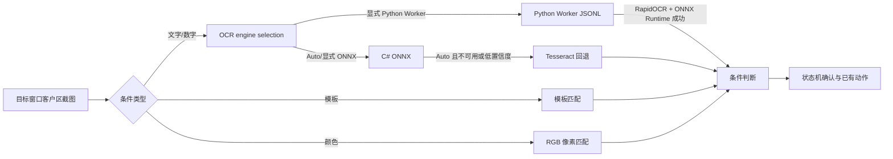

# 视觉识别架构

## 范围

本项目的视觉自动化只负责读取目标窗口客户区截图、识别状态并执行已有的鼠标动作。它不依赖上传的 Android APK 私有代码、私有模型或运行时资源，也不负责抓包、注入或发送网络数据。

## 只读进程内存读取基础层

`WPELibrary.Lib.Memory.ReadOnlyProcessIdentity` 和 `ReadOnlyProcessMemoryReader` 提供通用的只读进程内存读取能力。读取器只接受调用方提供的显式地址，使用 `PROCESS_VM_READ` 与 `PROCESS_QUERY_LIMITED_INFORMATION` 打开目标进程，并通过进程 ID、启动时间、名称和可获得的路径进行身份复核，避免 PID 复用后继续读取错误进程。

该层只暴露字节、整数和指针读取、进程身份复核及资源释放；不包含写内存、内存分配、远程线程、模块/签名扫描或封包发送接口。游戏对象布局、版本校验和业务状态读取必须在确认运行时证据后另行实现，不能把静态字段候选直接当作偏移使用。

## 移动端预设同步后端

移动端的开发拆分、状态机、协议字段、错误处理和验收矩阵维护在 [`mobile/IMPLEMENTATION_PLAN.md`](mobile/IMPLEMENTATION_PLAN.md)；本文件只保留稳定的系统边界和后端事实。

移动端第一阶段不在模拟器端执行抓包或滤镜。电脑端作为唯一预设数据源、管理端和执行端，通过 HTTPS OWIN Web API 提供完整只读预设同步和受控执行接口；模拟器端只展示并控制发送、递进、助手三类预设。模拟器可以缓存完整快照，用于显示名称、序号、分组、顺序、代码/封包内容、发送次数、发送间隔和对应模块参数，但不提供任何编辑写回能力：

进程注入模式下，`MobileSync` 必须由注入目标进程中的 `Socket_Form` 承载，而不是由注入器主窗体承载。预设缓存、当前目标套接字和发送/递进/助手执行状态都位于注入端；`Socket_Form_Load` 在加载数据库配置后调用 `StartRemoteMGT`，只有系统配置中的远程管理开关已启用，并且存在 HTTPS 地址、用户名和密码时才会启动监听。注入器主窗体不提前占用同一 HTTPS 端口，避免移动端连到没有目标执行状态的进程。服务关闭时沿用现有 `StopRemoteMGT` 生命周期。

`Socket_Form_Load` 只初始化目标窗体和移动服务，不自动调用 `StartHook_MainForm`；桌面用户仍通过现有 Hook 控件启动，移动端则由 `EnsureHookRunningForMobile` 按动作按需启动。这样打开封包窗体或进行 UI/模拟器审计不会隐式触发真实 Hook。

- `GET /MobileSync/manifest`：返回发送、递进、助手预设数量及内容版本摘要。
- `GET /MobileSync/snapshot`：返回三类预设的版本化完整只读 DTO（ID、名称、序号、分组、排序、代码/封包内容、发送参数、递进参数和助手指令配置）；不直接返回桌面端 XML、认证信息或未列入协议的内部状态。
- `GET /MobileSync/runtime`：返回三类预设的当前运行状态。
- `POST /MobileSync/send/{id}/start`、`POST /MobileSync/send/{id}/pause`、`POST /MobileSync/send/stop`：开始/恢复、暂停或停止电脑端发送预设。
- `POST /MobileSync/progression/{id}/start`、`POST /MobileSync/progression/{id}/pause`、`POST /MobileSync/progression/stop`：开始/恢复、暂停或停止电脑端递进预设。
- `POST /MobileSync/assistant/{id}/start`、`POST /MobileSync/assistant/{id}/pause`、`POST /MobileSync/assistant/stop`：开始/恢复、暂停或停止电脑端助手预设。

同步协议的目标加固规则：`schemaVersion=2` 起，分组使用稳定 `groupId`，名称只负责显示；快照中的二进制内容统一使用 Base64，移动端按需生成十六进制显示；间隔统一为毫秒，`loopCount=0` 表示连续发送。`manifest` 同时提供 `revision`、`payloadSha256`、`payloadBytes` 和能力列表，三者基于不含时间和哈希元数据的规范化快照正文计算，客户端只在服务端声明支持完整快照/版本绑定且快照通过版本、哈希、大小和字段范围校验后原子替换缓存。

启动接口必须携带移动端当前显示的 `expectedRevision`；电脑端发现版本不一致时返回 `preset_revision_mismatch`，不得执行移动端旧快照对应的请求。断网时移动端可以查看上一次完整快照，但不能把发送或停止显示为已成功；停止请求按 `jobId` 幂等处理，避免重复点击误停后续任务。

发送、助手和递进的暂停恢复还必须匹配暂停任务保存的 `revision`。即使 `jobId` 仍然存在，只要预设内容已经变化，恢复请求也返回 `runtime_revision_mismatch`，要求移动端先更新快照，避免旧任务状态套用到新预设。

版本摘要由三类完整预设快照的规范化内容计算 SHA-256；因此修改名称、序号、分组、顺序、发送封包/参数、递进参数或助手指令都会触发摘要变化。响应传输的是版本化的 allowlist DTO，不直接下发桌面端 XML；移动端没有本地快照时，首次连接会自动获取完整快照；已有缓存后重新连接只验证连接并刷新运行状态，不会自动替换本地快照。只有悬浮面板的“更新预设”会检查摘要并在变化时重新获取完整快照。移动端不写入预设，只能只读查看同步参数、选择已同步预设并请求电脑端执行或停止。

当前源码的 `MobilePresetSnapshot` 已返回三类完整只读 DTO；移动端使用稳定分组 ID、应用私有 `SnapshotStore`、`expectedRevision`/`requestId`、哈希/大小校验和原子快照提交。`SyncCoordinator` 负责保存凭据的自动连接、缓存回放、运行状态未知态和 Activity/悬浮服务生命周期；移动端仍不提供预设写回。真实 HTTPS 证书和目标业务动作联调仍需在目标环境中验收。

电脑端当前普通发送语义是：`LoopCNT` 统计完整遍历封包集合的轮数，`LoopCNT=0` 表示连续；`LoopINT` 在每个封包发送后等待。移动端显示和同步协议必须保持这一语义，不能把它误写成整轮间隔。

预设快照同步与运行状态同步分离：完整快照不做后台自动拉取，运行状态则在 Activity 可见或悬浮服务运行期间独立轮询，以便悬浮面板保持按钮操作反馈而不改变用户当前选择的预设。

`/MobileSync/*` 仅允许回环、私有网、链路本地和 ULA 地址，并要求独立的低权限代理账号 Basic Auth；管理员账号不能用于该路由，其他 Web API 路由仍使用远程管理管理员账号。移动端客户端强制 HTTPS、禁止明文 HTTP 和自动降级重定向。远程服务启动/停止是幂等的，HTTPS 监听或证书配置失败时服务保持关闭并写入明确日志。

移动端在首次配置或认证失败时显示 endpoint、移动端账号和密码输入；密码使用 Android Keystore 的 AES/GCM 加密后保存，网络请求使用 Basic Auth。应用使用保存的 HTTPS endpoint；首次没有 endpoint 时使用 `https://192.168.0.100:89/`。Activity、粘性悬浮服务或开机广播重建时会在凭据完整时自动连接。主配置内容根节点在凭据完整时隐藏，Activity 使用透明窗口并立即退到后台，只留下悬浮控制；首次缺少悬浮窗权限时只打开 Android 系统授权页。

移动端 snapshot 下载先依据 manifest 的 `payloadBytes` 加有限协议元数据空间限制响应体，再按规范化 UTF-8 正文做 SHA-256 和字节数校验；助手 `visionProfile` 即使为空也作为显式 `null` 保留，递进组合参数必须同时落在原始封包范围内。悬浮面板使用受限高度窗口，分组列表在面板内部滚动，避免浮层占满整个模拟器屏幕。

发送和助手执行入口在 UI 线程捕获不可变预设快照后再启动后台 Worker，避免桌面编辑列表时跨线程枚举绑定集合；停止接口能覆盖启动中的任务，并通过 `/MobileSync/runtime` 暴露 `starting`、`running`、`stopping` 和当前预设 ID。停止没有活动任务时返回 `accepted: false`，客户端应以当前 runtime 为准。

真实验收辅助程序采用 fail-closed 规则：只有目标进程可响应、模块枚举成功且实际发现 `WPELibrary.dll` 时才报告注入已证明；缺少任一条件均返回非零并标记 `target-injection-not-proven=true`。静态构建、UI 审计和模拟器启动不能替代这条真实目标验收。

递进启动预检通过结构化错误码区分预设无效、运行时忙、封包窗体未就绪和目标套接字不可用；移动端据此显示对应的预设、忙碌或连接错误，不把执行前置条件伪装成预设错误。

## 发送预设的实时连接路由

普通预设、批量发送、快捷键、移动端发送和字节递进都在发送启动前从当前捕获快照逐封包解析 `Socket`、源地址和目标地址。`Socket_Cache.SocketList.ResolveCurrentRoute(s)` 优先匹配封包类型与预设原目标；原目标已经变化时，只在同类型/方向候选唯一时切换到当前地址，多候选返回 `runtime_route_ambiguous` 并拒绝整组启动，没有候选返回 `runtime_not_connected`。候选使用 `getsockname/getpeername` 校验句柄仍可用，并按 `Socket + PacketFrom + PacketTo` 去重、按捕获时间保留最新记录；不会主动创建 TCP 连接。

`Socket_Send` 的实时入口让每个发送封包携带自己的 Socket、源地址和目标地址，不能由一个全局实时 Socket 覆盖整组封包。所有封包先完成路由预检，任一封包失败则不启动发送线程。实时地址只写入发送任务和界面临时状态，不写回发送预设数据库/XML；重新注入后由 `BeginCaptureSession` 过滤旧捕获记录，要求新会话至少捕获对应封包。路由日志只记录预设 ID、封包序号、原/当前地址、候选数和状态原因，不记录封包正文。

## 识别链路



### OCR

- `VisionOcrEngine.Auto` 保留本地 ONNX/Tesseract 顺序；Python Worker 需要显式选择，避免冷启动模型加载阻塞原有识别流程。Worker 不可用时不伪造文本。
- 显式选择 `PythonWorker`、`Onnx` 或 `Tesseract` 时不切换引擎；Python Worker 缺少运行时或依赖会返回不可用，不伪造文本。
- ONNX 使用外部模型目录，默认是应用程序目录下的 `models\ocr`，需要 `det.onnx` 或 `dbnet.onnx`、`rec.onnx` 或 `crnn_lite_lstm.onnx`、以及 `keys.txt` 或 `character_dict.txt`。
- 如果模型不是默认的 RGB/`(value-0.5)/0.5` 预处理，可在同一目录放置可选的 `preprocess.json`（或 `ocr_preprocess.json`），分别配置 `detector`、`recognizer` 的 `colorOrder`、`mean`、`std` 和 `outputIsLogits`；模型文件或该 sidecar 变化后会自动重载。
- 识别输入会读取 ONNX 图像输入的 4D 形状、通道数和 NCHW/NHWC 布局；不支持的输入 rank 会明确返回错误，不会静默套用错误形状。
- 对 PaddleOCR 风格 CRNN，解码器按 `keys.txt` 不含 blank、输出第 0 类为 CTC blank 处理，同时保留 blank 在末类的兼容分支。
- ONNX 识别器只接受真实推理输出；模型缺失、输出不兼容或推理异常会返回不可用/失败结果，不会生成假文本。

### Python Worker 与 JSONL

- `vision_worker/worker.py` 是独立的长驻进程：C# 前端通过标准输入发送一行 JSON，Worker 通过标准输出返回一行 JSON；协议日志写标准错误，同时写入用户目录下的有限滚动日志文件。
- `VisionPythonWorkerTextRecognizer` 串行化请求、按超时/取消重启子进程，并把 RapidOCR 文本框、文本和置信度转换成现有 `VisionOcrResult`；现有截图、区域边界、状态机和动作授权仍由 C# 前端负责。
- Worker 的 `ocr` 使用 RapidOCR 的 ONNX Runtime CPU 推理；`capture` 使用 Airtest Windows 窗口句柄截图；`airtest_action` 只有请求显式设置 `allow_system_input=true` 时才允许输入。
- Worker 依赖安装到 `%LOCALAPPDATA%\XNAS\WPE\vision-worker\python`，不写入用户数据库，不把 Python 环境塞进 ClickOnce 包；应用输出携带脚本、依赖清单、模型清单和安装脚本。Worker 提供 warmup 健康检查、有限滚动日志和请求诊断。

示例（数值只是模型包提供者应确认的示例，不代表本项目内置模型）：

```json
{
  "detector": { "colorOrder": "RGB", "mean": [0.5, 0.5, 0.5], "std": [0.5, 0.5, 0.5], "outputIsLogits": false },
  "recognizer": { "colorOrder": "RGB", "mean": [0.5, 0.5, 0.5], "std": [0.5, 0.5, 0.5], "outputIsLogits": true }
}
```

## 截图、区域与动作安全

- 所有 profile、步骤和动作验证区域都会在实际目标窗口客户区尺寸上做边界检查；截图识别结果仍以区域左上角为原点，鼠标动作会转换回客户区坐标后再执行。
- 真实鼠标动作默认关闭；`Socket_RobotForm` 在每次含动作的运行前显示警告确认，`VisionAssistantRunner` 和 `VisionMouseAction` 同时执行运行级授权校验，未授权时 fail-closed。
- `Auto` 截图模式对非前台窗口优先使用窗口渲染；屏幕截图检测到空白/均匀画面时会尝试安全渲染，仍为空白则跳过识别，不会拿旧缓存误判。
- 失败截图只清理本功能生成的 `wpe_vision_*.png`，并保留最近 200 张；模板、模板变体、预览和运行 profile 的位图在替换、移除、运行结束和窗口关闭时释放。
- 视觉缓存使用完整位图指纹，不依赖稀疏采样；Tesseract 输入管道采用异步写入并受识别超时/取消控制，避免识别线程永久阻塞。
- 模板匹配在开始前估算候选位置与像素比较量，超过上限时返回终止型识别失败，并在像素比较过程中持续响应取消。
- 系统鼠标输入在发送前重新确认目标仍为前台窗口；机器人异常向 `RunWorkerCompleted` 传播，关闭编辑器会停止机器人并等待识别资源空闲后再释放。

### 固定客户区助手模式

- `VisionCaptureSettings` 支持 `RequireExactClientSize`、`RequiredClientWidth` 和 `RequiredClientHeight`。固定游戏助手使用 `1280×720` 客户区像素坐标；旧助手默认关闭固定尺寸校验并保持原有归一化坐标行为。
- 固定模式在启动前、每次截图前和每次动作前检查目标窗口身份、可见状态、非最小化状态和实时客户区尺寸；主区域、步骤条件区域、模板区域及动作验证区域必须位于客户区内。
- 尺寸不符或运行中改变尺寸会生成终止型视觉失败，状态机立即停止，不重试、不跳过、不使用旧截图执行动作。后台但可见的窗口继续使用现有 `Auto`/窗口渲染截图能力；最小化窗口不参与识别。
- 固定尺寸字段随 `RobotVisionProfile` 写入 SQLite，并随机器人 XML 的 `CaptureSettings` 导入导出；缺少新字段的旧数据按关闭固定模式兼容读取。
- WinForms 视觉设置提供固定客户区复选框、宽高、当前尺寸状态和“应用 1280×720 固定配置”按钮。启用固定模式时，保存配置会拒绝归一化区域，要求在 `1280×720` 截图上重新框选像素区域。

### 颜色条件

`VisionColorMatcher` 使用 `System.Drawing.LockBits` 扫描截图，按 RGB 三个通道的最大绝对差判断像素是否命中，并同时支持：

- 目标 RGB 颜色；
- 每通道容差；
- 最小命中像素数；
- 最小命中比例；
- `ColorAppears` 与 `ColorDisappears` 条件。

颜色条件经过 `VisionConditionEvaluator` 和现有确认次数、轮询间隔、超时、失败策略状态机后，才会触发已有动作。

## 与机器人指令集的集成

- 左侧视觉助手新增文字等待或图片等待步骤时，会同步生成右侧 `RInstruction` 中的 `VisionWait` 行。
- `VisionWait` 行使用 `VisionStep|索引|名称` 内容引用 `VisionProfile.AssistantSteps`；右侧指令集的上下移动、删除和清空会同步调整或移除视觉步骤。
- 视觉等待行可以和键盘、鼠标、延时、循环等原有指令混排；标准机器人执行时按右侧行顺序逐条执行视觉等待。
- 机器人指令表仍由现有 SQLite/XML 指令序列化保存，视觉步骤本体继续由 `RobotVisionCondition`/XML `VisionProfile` 保存。
- Hook 过滤器的延迟发送/机器人任务使用有界队列，并在 Hook 停止时取消正在等待或运行的任务；队列槽位会持续占用到实际任务结束，避免只限制启动瞬间。

## Hook I/O boundary

- Overlapped and completion-routine `WSASend`/`WSARecv` calls pass through to Winsock unchanged; synchronous buffer rewriting is not safe for completion-driven I/O.
- Receive-side interception returns `SOCKET_ERROR` with `WSAEINTR` rather than zero bytes, so a filtered packet is not misreported as a closed connection. The raw packet is still sent to the existing processing/logging path.
- Multi-buffer synchronous send/receive paths preserve every `WSABUF.len` and clear unused replacement tails before the native call; TCP replay loops until the complete payload is sent or the native API fails.

## 配置与交付

- OCR 引擎、Python Worker 脚本/运行时路径、ONNX 模型目录、检测阈值、识别阈值和最大图像边长写入 `RobotVisionProfile`，并同步到 XML profile。
- 颜色条件写入 `RobotVisionCondition`，并同步到 XML assistant step。
- ONNX Runtime 使用 `Microsoft.ML.OnnxRuntime.Managed` 1.27.1；最终应用输出目录同时携带 x64 `onnxruntime.dll` 和 `onnxruntime_providers_shared.dll`。
- Python Worker 依赖由 `vision_worker/requirements.txt` 管理；`tools/Install-VisionWorker.ps1` 创建每用户环境并执行模型 SHA-256、`ping`、warmup 和 OCR 验收。
- 项目不内置 APK 中提取的模型。模型必须由使用者提供并确认其来源、许可证和适用性。
## Python Worker deployment boundary

The WinForms front end communicates with `vision_worker/worker.py` through
JSONL. Relative RapidOCR model paths resolve beside `worker.py`, and the
ClickOnce application package includes the three bundled ONNX files under
`vision_worker/models/ocr`; the worker refuses to download missing models.
RapidOCR preprocessing and threshold/filter settings are carried in the OCR
request, and returned boxes are mapped back to the captured source coordinates.

Airtest capture is selectable as a capture source. Airtest actions are used
only when the Python Worker engine is selected and require a short-lived,
one-shot, window-bound authorization token issued after the existing UI confirmation.
Python executable, worker script, and timeout settings persist in RobotVisionProfile
SQLite columns and the XML profile format.

## Mobile snapshot visual-profile boundary

`MobilePresetSnapshotBuilder` does not serialize `Socket_VisionProfile` directly.
The mobile snapshot uses an explicit JSON allow-list so persisted preset
configuration remains readable while desktop runtime state stays local. The
allow-list includes vision regions, OCR/matching thresholds, capture tuning,
assistant step conditions, declarative action definitions, and PNG template
resources. It excludes target window/process identity, run-scoped system-input
authorization, desktop executable/model paths, failure-snapshot directories,
and executable `IVisionAssistantAction` objects.

## Mobile runtime and action concurrency boundary

`SyncCoordinator` binds every asynchronous manifest, snapshot, runtime, and action
publication to the current session generation, client instance, and profile key.
After a profile switch, stale work may finish for cleanup but cannot publish into
the new Activity or floating panel. Runtime control remains disabled until all
three module statuses have a known state.

`MobileSync/runtime` is parsed fail-closed: all three module objects are required,
each state must be recognized, and known boolean fields must retain boolean JSON
types. `isBusy` is not used as the `running` flag because paused and stopping
tasks are also busy. Busy states must include a non-empty `presetId`, `jobId`,
and `revision`; the desktop DTO explicitly exposes `pausing`, and its `isBusy`
value includes the pausing transition. The client also rejects explicit boolean
flags that contradict `state`. Missing or malformed runtime data becomes
`UNKNOWN`, and is never rendered as an idle/stopped state.

Mobile action admission uses `expectedRevision`, request-scoped `requestId`, and
job/preset identity checks. The desktop request cache performs atomic per-request
deduplication while allowing unrelated request IDs to proceed independently;
cached rejected results retain their structured conflict response. Progression
publishes the task revision immediately after job creation and before the worker
can publish its first runtime sample, preventing a false stale-revision result.
Unexpected desktop action exceptions are converted into a cached non-accepted
result so a replay cannot repeat an operation with an unknown outcome.
Pause and resume admission rechecks the active task revision on the desktop
side. Stop is a job-scoped cleanup operation and remains available across a
revision change; duplicate progression stops remain accepted for the same
non-empty job ID even after the completed task has cleared from the current
runtime snapshot. When a mobile snapshot is newer than a busy runtime, the
client disables start/pause/resume while keeping stop available for cleanup.

The Activity never reveals its retired setup content. It restores the saved or
default HTTPS endpoint, starts the overlay as soon as Android grants overlay
permission, and moves itself behind the game. The sticky service and boot
receiver use the same coordinator, so process or emulator restarts reconnect
without credentials and keep the floating control as the only product surface.

## Dynamic fields and variables V1

Dynamic variables are implemented as an additive layer over the existing
WinForms, HexBox, SQLite, filter, and send-preset paths. `DynamicVariableDefinition`
owns a stable internal GUID and an editable uppercase symbol; `ExtractionRule`
stores fixed pattern bytes, a wildcard mask, packet type, and one or more
non-overlapping `DynamicField` ranges. `PatternMatcher` groups validated rules
by packet type and packet length, and `VariableExtractor` extracts all fields
from a matching final display buffer without database or UI access on the hot
path.

`WinSockHook` defers existing filter send/robot actions in their original
order, processes dynamic extraction after the existing filter transformation,
atomically updates the in-memory current values, and only then releases the
deferred actions. `SpeedMode` and `NoModify_NoDisplay` remain outside dynamic
extraction. History values are deduplicated and bounded in memory before batch
SQLite persistence; current values are session-only and are never restored from
history on startup.

Send presets retain their original `Buffer` BLOB and store optional
`PresetVariableBinding` metadata plus `SortOrder`. At task admission,
`VariableResolver` validates every binding and resolves a single immutable
`DynamicVariableSnapshot`; the resolved clone is then passed through the
existing socket send and operation paths. Continuous, multi-packet, robot, and
advanced-filter preset sends therefore share the same snapshot boundary, while
filter search/modify syntax remains unchanged.

The packet-detail HexBox and send editor expose dynamic-field/binding context
menus and combined ordinary-annotation/dynamic-field styling. Settings contains
an independent variable-center page for current values, rules, discovered
values, rule testing/editing/deletion, session pause, current-value clearing,
and labels. SQLite/XML backup and preset migration preserve old fixed presets;
old files without variable metadata load as ordinary data, while exports with
bindings warn that older software will ignore those bindings.

The review hardening path rejects malformed or duplicate variable definitions,
duplicate extraction sources, invalid packet directions, and invalid backup
rules before replacing the in-memory state. Send resolution reports the exact
failed variable ID/symbol, and manual preset sends surface the structured error;
filter/robot-triggered sends retain the existing asynchronous path and log the
same error. Dynamic-field and binding UI entry points validate buffer ranges,
null fields, source ownership, and weak fixed-byte patterns before mutating
definitions or rules. Saving and history flushing are skipped until the
dynamic-variable database has completed its initial load, preventing a failed
startup load from overwriting existing data.

## Persistence and service hardening

Preset and mapping mutations use a snapshot/mutate/atomic-save/rollback boundary.
The boundary covers send, filter, byte-sweep, robot, proxy-account, local-map and
remote-map collections, including ordering, folders, enabled state and imported
configuration. Startup loaders preflight table reads and parse into temporary
collections before replacing live lists; a failed or incomplete load marks the
system load incomplete and disables exit-time persistence, so an empty or partial
memory view cannot overwrite an existing database.

Configuration XML is validated before scalar mutation, and dynamic-variable
persistence reports a Boolean result to its UI callers. Backup import therefore
only persists a configuration section after its validation succeeds; UI paths
surface a save failure instead of treating an in-memory change as durable.

The TCP/TLS fallback host is bounded independently of the OWIN route layer:
TLS 1.2, 15-second handshake/request deadlines, 64 KiB request headers, 4 MiB
request bodies, 16 MiB response bodies, and 64 active clients. Active clients are
tracked and closed during disposal, while `MobileSync` remains limited to local
network addresses and an 8 MiB canonical snapshot. The ordinary Web API routes
remain behind administrator authentication.

## Treasure-map runtime bridge

The C6 Android reader publishes a read-only schema-2 JSONL stream through the
ADB-forwarded `127.0.0.1:28765` endpoint. `TreasureC6StreamProtocol` validates
the protocol/version, `actionAuthorized=false`, process/container identity,
contiguous sequence, complete-snapshot boundary, and current-membership event
semantics. Transport or protocol loss clears the consumable snapshot; it never
falls back to a historical JSON state file.

`TreasureMapPresetRunner` is an explicit state machine. It supports a frozen
current-snapshot mode and a continuous mode, binds each member to a C6 session /
process / container identity plus a coordinate version, and processes members in
ascending `packageNum` order. The production robot entry sends a `0x5828` Jump,
observes receive-side arrival evidence when available, then sends the validated
legacy `0x783A` Use frame without blocking on a missing arrival frame. An
explicit V3 instruction may choose its own evidence policy. In continuous mode it
waits for C6 consumption confirmation and does not issue a mid-route compensating
Jump; an actual consumption timeout starts the existing target retry path. The
Jump/Use path keeps its first Use-only retry, while the AutoDig path keeps the
initial Jump and retries only the AutoDig frame so a timeout cannot repeatedly
fly the same coordinate.
The Use frame rebinds only the C6 inventory position and prefers the
type/num/param fields from the current session, current capture list, or saved
ordinary send preset. When no current Use template exists, the production entry
uses the saved current-route `0xB0F4` AutoDig preset byte-for-byte (including the
known 22-byte legacy form); the closed 24-byte AutoDig frame remains the final
compatibility fallback.

The default mode is continuous. A newly created treasure-map instruction
therefore keeps listening after the current batch; after a target completes it
immediately checks for another uncompleted member and only blocks on the next
C6 event when no new member is available. An explicitly encoded
`CurrentSnapshot` instruction remains one-shot and freezes the first complete
snapshot. Continuous mode has no periodic second-cycle timer.

The send boundary classifies results as `NotDispatched`, `Dispatched`, or
`Ambiguous`; only the first category can use bounded retry. In the production
Jump/Use path, the first consumption timeout retries Use only, and only a later
retry performs a full Jump/Use pair; an ambiguous result stops the run without
repeating the unknown action. The captured Socket handle is not stored in the
prepared frame; the one-shot send boundary resolves the current Socket again and
requires the runtime-only `TREASURE-LIVE-SEND` authorization. Robot execution
shares the outer pause gate and cancellation token, while the desktop mode
selector stores a versioned static instruction payload. The fixed delay is a
pacing interval only; it is not treated as a role-position confirmation.
Synthetic tests still do not imply a live game send.

Version-3 treasure instructions may opt into a cooperative controller policy
and explicit arrival-evidence enforcement. The default policy remains
`Exclusive` plus `Shadow`: one runner owns the in-process action boundary, and
missing arrival frames are diagnostic only. `Enforced` consumes receive-side
arrival evidence from the thread-safe observation FIFO and fails closed before
AutoDig/Use when no post-Jump frame matches the frozen scene and coordinates.
Invalid persisted instruction text is rejected at execution time rather than
silently converted into a sendable continuous instruction.

In continuous mode, consumption confirmation polls the current C6 snapshot every
25 ms with a 2500 ms default upper bound. A target that disappears or changes
version exits immediately. The production Jump/Use path first retries Use only
after a timeout, then uses the existing cooldown before any full Jump/Use
compensation; the explicit AutoDig compatibility path retains its own
Jump+AutoDig retry semantics. This prevents delayed inventory updates from being
mistaken for a failed action and retried with an unnecessary second Jump.

The runner also emits deduplicated `recognition` diagnostics for empty
snapshots, unrecognized targets, detected targets, and waiting for a new
target; repeated empty snapshots are limited to one heartbeat every five
seconds. Jump/Use or AutoDig result codes and success flags precede packet text
in the human-readable log, and recognition entries do not change send counters
or the runner's last-error state.

`TreasureMapRunLogStore` mirrors every structured runner entry to bounded
JSONL at `%LOCALAPPDATA%\XNAS\WPE\treasure-map\logs\treasure-map.jsonl`.
The active file is readable while the assistant is running, is limited to
5 MiB with five numbered archives, and is flushed on every entry so process
exit does not discard the run timeline. Records contain the run ID, timestamp,
logical step/packet kind, result code, retry, success flag, process ID, per-run
`attemptId`, and safe slot/scene/coordinate fields; send/timeout records retain
the prepared target coordinates even if the live snapshot has already advanced.
Raw packet bytes, C6 payloads, and member identities are excluded. Persistence
failures are reported once to the existing in-memory system log and never stop
the runner.

The production preset path wraps the TCP client in
`TreasureC6BufferedInventoryStream`. A long-lived reader task validates every
C6 message in order and updates the latest snapshot while the runner is sending
or pacing; the runner-facing wake-up retains only the newest notification, so
stale periodic snapshots cannot accumulate. Reader waits longer than 500 ms are
reported as `c6_wait_ms` recognition diagnostics. When the controller starts or
replaces the resident reader it requests the supported 10 ms poll interval and
restarts a matching reader that is still using the older interval.

The resident JSON bridge remains available for compatibility and offline
regression. It is not the source used by the production C6 preset path, and no
live game send is implied by build or synthetic test evidence.

The Android reader treats `packageNum=0` as an empty slot rather than a formal
treasure-map member. The slot remains watched by the fast cache, while a later
non-zero assignment is emitted as a normal add transition instead of an
unproven package replacement that would force a full refresh.

LuaJIT container Node/Mask relocation is an internal layout change, not a new
inventory identity, when the validated `BagMgr` and `m_ItemDict` addresses are
unchanged. The reader rebinds that layout through the cached, class-validated
owner rather than rescanning all memory. Formal member identity comes from the
container key after it matches the item's `m_Id`; an object pointer is only a
read location. Reuse of one non-zero `packageNum` by a new validated member is
serialized as `removed` followed by `added`, which keeps every intermediate
host snapshot package-unique.

`TreasureC6ServiceController` prepares the external read-only reader on demand
when execution reaches a treasure-map instruction. The main assistant entry can
therefore start with the same established game route used by ordinary send
presets; C6 is not a global startup gate. The controller discovers `adb.exe`
and an online emulator, prefers the current foreground Android application,
falls back to configured/known package names, resolves the running game PID,
reuses or launches the resident reader, and recreates
`tcp:28765 -> localabstract:piaomiao.treasure.stream`. This keeps package-name
changes from being tied to one hardcoded identifier while rejecting Android
system/launcher packages. The controller does not send game packets and leaves
the reader/forward available for subsequent runs. A per-assistant
`TreasureLiveSendAuthorized` flag stores the explicit first-run live-send
confirmation; the execution parameter remains separate and is only enabled when
that persisted flag is true. If C6 preparation fails, ordinary robot steps are
not blocked, while the treasure-map step fails closed without sending an
unknown target.

## 召唤兽技能书助手预设

现有助手列表新增内置预设 `召唤兽技能`，默认禁用，沿用 `RobotInstruction` 的 SQLite/XML 数据结构和 `RobotList.SaveRobotList_ToDB()` 原子保存路径。数据库加载时，如果该名称不存在则创建；如果已有同名预设且已有用户指令，不覆盖用户内容；空指令的同名预设才补齐内置步骤。

该预设使用 `InstructionType.SummonedPetSkillBook`，由 `SummonedPetSkillBookPresetPlan` 生成 16 行可持久化、可读的步骤内容。助手网格沿用现有格式化入口，显示为“序号 + 状态 + 中文说明”，顺序固定为：

`IDLE → VERIFY_CURRENT_PET → LOAD_PET_STATE → CHECK_MATERIALS → OPEN_SLOT_SUBMIT → OPEN_SLOT_WAIT → OPEN_SLOT_VERIFY → BOOK_CHECK → STUDY_SUBMIT → STUDY_WAIT → SKILL_DIFF → LOCK_SUBMIT → LOCK_WAIT → LOCK_VERIFY → NEXT_BOOK → COMPLETE`

保存前的指令校验要求这 16 行全部使用该类型、顺序连续、内容能通过版本化编解码，并拒绝与普通机器人指令混排或损坏步骤。这样每一本书前后的宠物确认、资源检查、开格等待/确认、技能书检查/提交/刷新、技能差异识别、锁定提交/确认和下一本/完成日志步骤都会明确出现在预设中。

当前运行入口只验证步骤内容，随后 fail-closed 地暂停并提示“只读召唤兽数据适配器和正常 UI/业务事件适配器尚未接入”，不会执行游戏操作。后续实现只能接入已经确认的只读数据来源和正常 UI 事件、业务接口或测试适配器；`ReadOnlyProcessMemoryReader` 只提供显式地址的只读读取，不提供写内存、扫描、远程线程或封包发送能力。该预设路径不使用 OCR 或截图，也不包含未经确认的游戏对象偏移。
