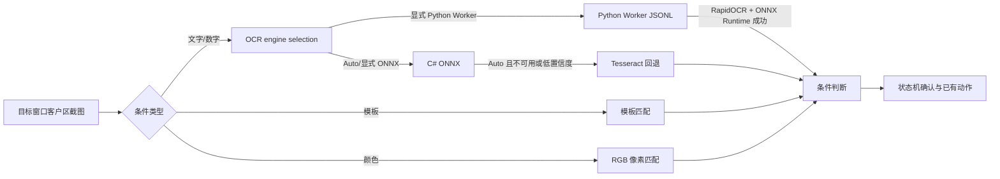

# 视觉识别架构

## 范围

本项目的视觉自动化只负责读取目标窗口客户区截图、识别状态并执行已有的鼠标动作。它不依赖上传的 Android APK 私有代码、私有模型或运行时资源，也不负责抓包、注入或发送网络数据。

## 只读进程内存读取基础层

`WPELibrary.Lib.Memory.ReadOnlyProcessIdentity` 和 `ReadOnlyProcessMemoryReader` 提供通用的只读进程内存读取能力。读取器只接受调用方提供的显式地址，使用 `PROCESS_VM_READ` 与 `PROCESS_QUERY_LIMITED_INFORMATION` 打开目标进程，并通过进程 ID、启动时间、名称和可获得的路径进行身份复核，避免 PID 复用后继续读取错误进程。

该层只暴露字节、整数和指针读取、进程身份复核及资源释放；不包含写内存、内存分配、远程线程、模块/签名扫描或封包发送接口。游戏对象布局、版本校验和业务状态读取必须在确认运行时证据后另行实现，不能把静态字段候选直接当作偏移使用。

## 坐骑状态专用只读读取器

缓存提速分为进程内定点、同进程权威缓存和跨进程暖提示三层：同一长驻探针内，在 PID、启动 tick、可执行文件、当前映射和坐骑上下文都未变化且上一轮已经验证完整 21 张卡时，临时复用 `m_RideIns`、`m_ResetData` 外层索引和卡片容器位置做定点只读；任一地址、映射、身份、绑定、卡片数量或动态字段校验失败，立即丢弃定点计划并回到安全缓存/发现路径。该绝对地址计划只存在于探针进程内存，不写入磁盘缓存或暖提示。

Android 进程身份变化后可读取独立的相对布局暖提示。进程重启会改变分配段、Lua 表哈希顺序和节点偏移，因此持久 sidecar 不保存绝对地址；运行时最多把映射类别、相对位置和大小提示物化到本次进程的当前映射，再重新验证六个基础字段、唯一当前角色、坐骑绑定、当前坐骑实例、`m_ResetData` 和完整 21 张卡，失败即回到完整发现。没有暖提示时先尝试不超过 16 个且占比不超过总映射 25% 的小映射；该冷启动优先级同样只是可失败的第一阶段，命中后立即停止，未命中继续完整发现。

Android 探针返回的有效快照会根据当前进程 PID、进程启动 tick 和可执行文件稳定推导 `sessionId`；同一进程的连续探针调用因此保持会话连续，进程重启时才形成新的会话。错误快照仍会在协议校验阶段被拒绝，不参与坐骑上下文连续性判断。

Android 探针若返回 `needs_discover` 且诊断码为 `local_player_missing` 或 `field_string_missing`，桥接层只做一次可取消的短延迟重试，用于覆盖角色对象尚未完成加载的瞬时窗口；其他探针错误不重试，严格协议校验和 fail-closed 边界不变。

`WPELibrary.Lib.MountSpeed.MountStatusMemoryReader` 在通用只读层之上读取坐骑状态快照。调用方必须通过 `MountStatusMemoryLayout` 提供已确认的显式地址和数据类型；读取器不扫描、不猜测偏移，也不调用现有的坐骑内存写入器。

快照以 `MountStatusReadResult` 返回，包含成功标志、错误码、进程 ID、启动时间、读取会话 ID 和递增序号。`IsMounted` 是当前必需字段；坐骑 ID、基础速度、坐骑加成速度和角色移动速度在地址未确认时保持未读取状态，合法的 `0` 与 `false` 不会被误判为读取失败。每次读取都会复核进程身份并写入现有有界内存追踪日志。共享 Root broker 的内存块批次同时受最多 32 个命令和 32 MiB 原始数据约束，并使用至少 30 秒批次超时；Python 客户端通过一条持久命名管道和 1 MiB 缓冲读取大 JSONL 响应，连接建立阶段允许服务端管道重建的短重试，但已经写入的读取命令不重复提交。轻量进程身份、映射和状态命令仍使用较短超时；批次失败保持 fail-closed，并由探针输出具体缺失字段，不能把通道超时当作有效角色。

目标 Android LuaJIT 客户端不使用稳定的原生坐骑结构体偏移。`tools/mount-reader/mount_status_luajit_probe.py` 通过 rooted ADB 对匿名可读写映射做有界只读扫描，验证 `m_PlayerId`、`m_IsLocalPlayer`、`m_RideId`、`m_RoleMoveSpeed`、`m_Gx` 和 `m_Gy` 的 GC64 字符串键及其表节点值；`m_Gx/m_Gy` 兼容整数和有限浮点盒装值，浮点坐标在输出协议前归一化为 Int32。探针按唯一 `m_IsLocalPlayer=true` 角色生成 `mount_status_snapshot.v1`。同一 PID 的真实前后样本已确认 `m_RideId=nil/9111` 与 `m_RoleMoveSpeed=200/256` 的动态切换，当前运行时可据此可靠判定骑乘状态。探针只读内存，不写内存、不注入、不调用游戏方法、不发包，并绑定 PID 与 `/proc/<pid>/stat` 启动 tick。

`MountStatusReadOnlySnapshotProtocol` 严格拒绝非只读、非 `ok`、多候选、进程身份不完整或未绑定本地角色的快照。`MountStatusAndroidSnapshotReader` 负责桌面端 ADB/Python 桥接；包含坐骑预设的助手启动时由 `Socket_Robot` 创建本次运行专用读取器，在 `StartRobot` 预检阶段强制重新读取 LuaJIT 快照并清除旧快照，读取成功后才进入后台步骤；后续步骤只复用本次启动快照。仍显式提供 Windows 布局的调用方保留原有读取路径。两条路径都只缓存有效快照，不执行坐骑写入、封包发送或状态切换。

坐骑技能沿独立的只读链路解析：探针在同一进程快照中定位 `LocalRide.m_Rideskills`，校验外层 `GCtab`、数组中的技能对象以及对象内 `skillId`/`exp` 两个字段后，输出 `player.rideInstances[]`。`LocalRide.PropertyValueDict` 的 `SHAPE` 与 `RIDEING` 作为绑定证据；只有一个实例同时满足 `SHAPE == MapRole.m_RideId` 且 `RIDEING == 1` 时，才输出 `activeRideInstanceId` 和 `rideBindingStatus=bound`，否则保持未绑定或歧义。当前现场已确认 `m_RideId=9111` 绑定 `rideInstanceId=2091811378351566852`。`ride_skill_name_map.json` 使用 `data_RideSkill` 字节码注册时的 `skillId → name` 配对补充 `skillName`，不以可复用的 `icon` 反推名称。C# 的 `RideInstances`、`SkillName` 和实例绑定字段都可选，缺失时按空列表/空名称/未绑定处理，结构不完整时拒绝快照。

坐骑成长率沿同一只读快照增加可选 `player.growthRate`，并按每个 `rideInstances[]` 的 `rideShapeId` 透传 `growthRate` 与来源。探针从已绑定的 `LocalRide.PropertyValueDict.GROWUP` 读取当前实例值；`RideData[Shape].GrowthRate` 只属于模板数据，不作为当前成长率。当前值保持客户端的浮点表示，不再做 940 类模板值的换算；桌面只读界面同时显示当前坐骑和各实例的“当前成长率”，不因此获得写内存或操作能力。

坐骑炼化页面的临时技能卡片也沿同一只读快照输出为可选 `player.rideRefineCards[]`：当前/自带卡固定保留页面索引 1，候选卡来自选中 `LocalRide.m_ResetData[4]` 的内层 33 槽表，当前客户端现场验证为索引 2–21 共 20 张，因此页面合计 21 张。候选卡的 `growty` 按 `growty/1000` 透传为当前卡片成长率，`speed`/`score` 保留为可选原始值；卡片技能 ID 从 `skill[].name` 的数字字符串读取，`val` 仅保留为原始 `value`，不当作技能经验。解析不完整或不是完整 20 张候选卡时返回空列表；该链路仍不写内存、不发包、不触发炼化。

桌面只读刷新会在当前窗体内保留上一次成功快照，按卡片索引比较成长率、速度、评分和技能，并显示新增、消失或字段变化。若 PID 启动 tick、当前坐骑实例 ID 或坐骑 ID 发生变化，则放弃旧卡片比较并建立新基线；该基线不写入数据库，也不跨窗体持久化。

`MountSpeedPreset.TargetSkills` 是坐骑预设的可选目标集合，每项可只填 `SkillId`、只填 `SkillName`，或同时填写两者；同时填写时要求同一当前技能同时满足 ID 和名称，避免名称映射错误造成误判。`MountSkillPresetPreview` 只接受已通过协议校验的 `MountStatusReadOnlySnapshot`，先确认 `ActiveRideInstanceId` 对应唯一 `IsCurrent` 实例，再对目标集合生成逐项状态和摘要。`Socket_Robot` 在启动预检中保存这份结果；未形成完整四项目标时，后续 `IDLE` 只展示本次启动的快照和预演结果，预演没有任何写内存、输入、封包或洗炼调用。

坐骑炼化目标另由 `MountSpeedPreset.TargetGrowthRate` 与恰好 3 个 `TargetSkills` 组成四项配置。`MountSpeedPreset.CreateDefaultFirstRideRefinePreset` 为新建或尚未配置坐骑目标的编辑入口提供固定默认目标：高级秋水流弦（61108）、高级百步穿杨（61118）、高级追魂夺命（61117）和成长率 `1.175`；已有保存预设不被自动覆盖，清空目标仍可保持普通只读速度模式。名称为 `一坐骑洗炼` 的助手从列表/快捷方式启动时，`Socket_Cache.DoRobotAsync` 与 `Socket_RobotForm` 的启动参数构建都会在目标为空或不完整时自动补入该固定目标，不要求用户重复填写；其他坐骑预设不走该兜底。`MountRideRefineTargetMatcher` 对只读 `rideRefineCards` 的全部页面卡片逐张判断：成长率按 `0.0005` 容差匹配，三个技能使用一对一无序匹配，因此技能在卡片中的行顺序不影响结果；默认卡片 1 和候选卡 2–21 都纳入判断，任一张卡同时满足四项即为命中。该 matcher 本身只返回匹配结果；完整四项目标由 `Socket_Robot` 的 `IDLE` 接线交给 `MountRefineStateMachine`，由状态机控制发送前检查、发送后刷新和命中停止，仍不写内存或点击页面。

首次加载助手列表时，`Socket_Cache.Robot.EnsureBuiltInFirstRideRefinePreset` 将旧的 `坐骑速度` 11 步模板复制到 `一坐骑洗炼`，并为后者补齐固定四项目标；旧记录保留作为回退。若一坐骑记录为空，列表加载和 `DoRobotAsync` 启动入口都会自动生成同一套坐骑步骤，避免“目标已经配置但机器人指令为空”导致无法进入 `StartRobot`。

`Socket_RobotForm` 通过动态“坐骑目标”页编辑上述四项：技能列表限制为 3 项，另有目标成长率输入框；列表项支持 ID/名称添加或更新、删除和从已保存助手读取。只有 3 个技能和成长率都填写完整时，“应用到助手”才保存炼化目标。页面的“刷新只读快照”使用本次调用专用的 `MountStatusAndroidSnapshotReader`，同时显示当前坐骑、21 张卡片、技能名称和两个只读预演结果，不改变预设，也不执行游戏动作。

`MountRefineStateMachine` 将上述只读快照和目标匹配组织成独立的炼化循环：首次读取后先检查目标，未命中才经过 `IMountRefinePacketSender` 闸门；发送被接受后固定发送前快照为本轮基线，并持续轮询同一 PID、启动 tick、会话、坐骑和当前坐骑实例。只有候选快照有效、完整包含 21 张卡、sequence 严格大于发送前基线，并且卡片内容相对发送前基线确实变化时，才进入 verify 和四项目标判断；sequence 未推进，或 sequence 已推进但卡片内容未变化，都只写入有界等待事件并继续可取消轮询，不做目标判断、不重复发送。等待期间不会用候选 sequence 覆盖发送前基线，因此同一推进序号下稍后出现真实卡片变化仍可恢复。真实读取失败、卡片不完整或任一坐骑上下文变化仍 fail-closed 停止。单次刷新等待超时只继续轮询同一次发送结果，不自动重发，也不把超时当作终止条件。`Socket_Robot` 在完整四项目标的一坐骑 `IDLE` 步骤创建本次运行状态机；本次明确启动会把当前有效 A050 出站捕获作为本次会话的协议验收依据，并生成不落盘的临时发送授权。没有有效当前出站捕获时仍使用 `FailClosedMountRefinePacketSender`，离线 `RecordingMountRefinePacketSender` 只记录上下文；真实服务端接受条件仍需通过一坐骑单次实机测试确认。

Android 桥接结果另保留 `WasCancelled` 标记，和普通读取错误分开传递到 `MountRefineStateMachine`；首读或发送后刷新阶段若确认共享取消令牌已触发，则以 `UserStopped / mount_refine_user_stopped` 结束，不能把宿主停止误报成探针故障。`Socket_Robot.StopRobot()` 在取消活动状态机前写入 `stop_requested` 结构化事件，再执行状态机取消；该事件只记录状态与验收元数据，不记录原始封包，也不绕过取消闸门。探针首次发现或缓存失效时仍可能执行完整扫描；换进程时先执行经过完整校验的暖提示优先扫描，同进程 PID、启动 tick、可执行文件和缓存版本有效时才直接使用引用方案及实际访问页缓存。`MountStatusAndroidSnapshotReader` 长驻一个 JSONL 探针进程，让同一读取器在多次刷新之间复用同一个 Root ADB shell；长驻探针若已耗尽整轮响应超时，不再启动一次性进程重复同一后端扫描。机器人结束、启动失败和桌面手动刷新完成时都会释放探针；缓存路径失败、结构变化、卡片不完整或刷新读取超时仍 fail-closed，不把慢读取改写成成功读取。

当前提速实现再增加进程内 `point` 定点读取：只在同一 PID、启动 tick、可执行文件和当前映射下复用已验证的 `m_RideIns`、`m_ResetData` 外层索引及卡片容器位置；动态卡片仍逐轮读取，任一校验失败立即清空定点计划并回退。无暖提示的新进程先尝试不超过 16 个且占比不超过总映射 25% 的小映射，命中即停，失败继续完整发现。探针 `reader.readPath` 现在标识 `point/fast/warm/cold/discover/fallback`，同时输出 Root/ADB、探针和丰富字段/卡片解析耗时；桌面运行日志补充读取总耗时及 `send_result` 到 `verify_new_snapshot` 的单调耗时。成功刷新后的默认轮询间隔由 500ms 调整为 250ms，3 秒确认窗口、2.8 秒单次读取上限、PID/startTicks/session/坐骑实例/21 张卡和 fail-closed 边界不变。

## Android Root/ADB 会话统一边界

`WPELibrary.Lib.Android.AndroidRootShellSessionManager` 按 `adb.exe` 绝对路径和设备序列号，在当前桌面进程内缓存一个持久的 `adb -s <serial> shell -t su -c sh`。C# 读取器通过 `Acquire(...).Execute(...)` 执行只读探针、进程诊断和 reader 生命周期命令；释放调用方 lease 不会关闭缓存会话，Root 管理器只需在首次建立会话时处理一次 Shell 授权。会话退出或设备/序列号变化时才重新建立对应会话，进程退出时统一清理。

坐骑探针和装备属性 reader 通过 `--root-broker-pipe` 使用该会话的本地命名管道；broker 服务端允许一个已连接客户端连续提交多条串行命令，避免每个内存批次重建管道。宠物属性读取在普通 shell 报告进程内存权限不足时复用同一会话；藏宝图 C6 的所有 Root 命令也复用同一入口。桌面生产路径不得在新预设或新 reader 中自行拼接 `adb shell su`、`adb exec-out su` 或逐次启动 Root shell；新增 Android 只读预设必须接入 `AndroidRootShellSessionManager`，脚本必须接收并使用 `--root-broker-pipe`。脚本保留的无 broker `su` 分支仅用于独立 CLI 兼容，不属于桌面预设运行路径。普通 `adb devices`、包名/PID 查询和非 Root 读取仍保持普通 shell，不额外申请超级用户权限。

用户提供的坐骑请求样本均为 39 字节 `4D5A` 帧，body 长度为 `0x1D`，原始协议号为 `0xA050`；样本的偏移 12--18 操作前缀和偏移 19 的 `0x13` 长度字段一致，偏移 20--38 为固定的 19 位 ASCII 数字。`MountRefineA050PacketTemplate` 严格校验这些结构，并按当前客户端行为逐字节复制捕获帧，不再根据只读快照改写尾部字段；只读快照中的坐骑实例 ID 仍用于上下文绑定和刷新前后身份校验。样本用于结构匹配，服务端业务接受仍以当前注入捕获和单次实机结果为准。

注入模式下的发送方向由当前捕获自动绑定，不要求预设保存 Socket 或用户手填方向。捕获队列在进入受页面筛选和 5000 条自动清空限制的 `lstRecPacket` 前，会把结构有效的 A050 出站记录复制到最多 64 条的当前注入会话证据缓冲；`BeginCaptureSession` 必须先清空该缓冲，因此证据不跨注入会话。停止抓包只关闭采集，不清空当前会话证据；下一次开始抓包或程序退出时才重建/清理。`MountRefineA050CaptureBinding` 同时检查可见列表和本会话证据，忽略入站包，并要求 `PacketSocket + PacketFrom + PacketTo` 组合唯一；同一 Socket 经 `send`/`WSASend` 包装层重复观察不会误报方向冲突，缺少候选或多个真实方向仍拒绝绑定。`Socket_Robot` 每次坐骑炼化启动都重新建立 A050 模板和方向，不沿用旧坐骑或旧会话模板；一坐骑明确启动且捕获成功时同步设置本次运行的协议验收和临时授权。`MountRefineA050SocketPacketSender` 保存当前会话捕获记录里的原始 Socket、封包类型和方向，并按手动发送路径直接使用这组路由，不在发送时按目标地址重新切换连接；Socket 仍不跨会话持久化。自动接线已经完成，真实发送后的服务端接受和卡片刷新仍以实机日志为准。

## 移动端预设同步后端

移动端的开发拆分、状态机、协议字段、错误处理和验收矩阵维护在 [`mobile/IMPLEMENTATION_PLAN.md`](mobile/IMPLEMENTATION_PLAN.md)；本文件只保留稳定的系统边界和后端事实。

移动端第一阶段不在模拟器端执行抓包或滤镜。电脑端作为唯一预设数据源、管理端和执行端，通过 HTTPS OWIN Web API 提供完整只读预设同步和受控执行接口；模拟器端只展示并控制发送、递进、助手三类预设。模拟器可以缓存完整快照，用于显示名称、序号、分组、顺序、代码/封包内容、发送次数、发送间隔和对应模块参数，但不提供任何编辑写回能力：

进程注入模式下，`MobileSync` 必须由注入目标进程中的 `Socket_Form` 承载，而不是由注入器主窗体承载。预设缓存、当前目标套接字和发送/递进/助手执行状态都位于注入端；`Socket_Form_Load` 在加载数据库配置后调用 `StartRemoteMGT`，只有系统配置中的远程管理开关已启用，并且存在 HTTPS 地址、用户名和密码时才会启动监听。注入器主窗体不提前占用同一 HTTPS 端口，避免移动端连到没有目标执行状态的进程。服务关闭时沿用现有 `StopRemoteMGT` 生命周期。

`Socket_Form_Load` 只初始化目标窗体和移动服务，不自动调用 `StartHook_MainForm`；桌面用户仍通过现有 Hook 控件启动，移动端则由 `EnsureHookRunningForMobile` 按动作按需启动。这样打开封包窗体或进行 UI/模拟器审计不会隐式触发真实 Hook。

- `GET /MobileSync/manifest`：返回发送、递进、助手预设数量及内容版本摘要。
- `GET /MobileSync/snapshot`：返回三类预设的版本化完整只读 DTO（ID、名称、序号、分组、排序、代码/封包内容、发送参数、递进参数和助手指令配置）；不直接返回桌面端 XML、认证信息或未列入协议的内部状态。
- `GET /MobileSync/runtime`：返回三类预设的当前运行状态。
- `POST /MobileSync/send/{id}/start`、`POST /MobileSync/send/{id}/pause`、`POST /MobileSync/send/stop`：开始/恢复、暂停或停止电脑端发送预设。
- `POST /MobileSync/progression/{id}/start`、`POST /MobileSync/progression/{id}/pause`、`POST /MobileSync/progression/stop`：开始/恢复、暂停或停止电脑端递进预设。
- `POST /MobileSync/assistant/{id}/start`、`POST /MobileSync/assistant/{id}/pause`、`POST /MobileSync/assistant/stop`：开始/恢复、暂停或停止电脑端助手预设。

同步协议的目标加固规则：`schemaVersion=2` 起，分组使用稳定 `groupId`，名称只负责显示；快照中的二进制内容统一使用 Base64，移动端按需生成十六进制显示；间隔统一为毫秒，`loopCount=0` 表示连续发送。`manifest` 同时提供 `revision`、`payloadSha256`、`payloadBytes` 和能力列表，三者基于不含时间和哈希元数据的规范化快照正文计算，客户端只在服务端声明支持完整快照/版本绑定且快照通过版本、哈希、大小和字段范围校验后原子替换缓存。

启动接口必须携带移动端当前显示的 `expectedRevision`；电脑端发现版本不一致时返回 `preset_revision_mismatch`，不得执行移动端旧快照对应的请求。断网时移动端可以查看上一次完整快照，但不能把发送或停止显示为已成功；停止请求按 `jobId` 幂等处理，避免重复点击误停后续任务。

发送、助手和递进的暂停恢复还必须匹配暂停任务保存的 `revision`。即使 `jobId` 仍然存在，只要预设内容已经变化，恢复请求也返回 `runtime_revision_mismatch`，要求移动端先更新快照，避免旧任务状态套用到新预设。

版本摘要由三类完整预设快照的规范化内容计算 SHA-256；因此修改名称、序号、分组、顺序、发送封包/参数、递进参数或助手指令都会触发摘要变化。响应传输的是版本化的 allowlist DTO，不直接下发桌面端 XML；移动端没有本地快照时，首次连接会自动获取完整快照；已有缓存后重新连接只验证连接并刷新运行状态，不会自动替换本地快照。只有悬浮面板的“更新预设”会检查摘要并在变化时重新获取完整快照。移动端不写入预设，只能只读查看同步参数、选择已同步预设并请求电脑端执行或停止。

当前源码的 `MobilePresetSnapshot` 已返回三类完整只读 DTO；移动端使用稳定分组 ID、应用私有 `SnapshotStore`、`expectedRevision`/`requestId`、哈希/大小校验和原子快照提交。`SyncCoordinator` 负责保存凭据的自动连接、缓存回放、运行状态未知态和 Activity/悬浮服务生命周期；移动端仍不提供预设写回。真实 HTTPS 证书和目标业务动作联调仍需在目标环境中验收。

电脑端当前普通发送语义是：`LoopCNT` 统计完整遍历封包集合的轮数，`LoopCNT=0` 表示连续；`LoopINT` 在每个封包发送后等待。移动端显示和同步协议必须保持这一语义，不能把它误写成整轮间隔。

预设快照同步与运行状态同步分离：完整快照不做后台自动拉取，运行状态则在 Activity 可见或悬浮服务运行期间独立轮询，以便悬浮面板保持按钮操作反馈而不改变用户当前选择的预设。

`/MobileSync/*` 仅允许回环、私有网、链路本地和 ULA 地址，并要求独立的低权限代理账号 Basic Auth；管理员账号不能用于该路由，其他 Web API 路由仍使用远程管理管理员账号。移动端客户端强制 HTTPS、禁止明文 HTTP 和自动降级重定向。远程服务启动/停止是幂等的，HTTPS 监听或证书配置失败时服务保持关闭并写入明确日志。

移动端在首次配置或认证失败时显示 endpoint、移动端账号和密码输入；密码使用 Android Keystore 的 AES/GCM 加密后保存，网络请求使用 Basic Auth。应用使用保存的 HTTPS endpoint；首次没有 endpoint 时使用 `https://192.168.0.100:89/`。Activity、粘性悬浮服务或开机广播重建时会在凭据完整时自动连接。主配置内容根节点在凭据完整时隐藏，Activity 使用透明窗口并立即退到后台，只留下悬浮控制；首次缺少悬浮窗权限时只打开 Android 系统授权页。

移动端 snapshot 下载先依据 manifest 的 `payloadBytes` 加有限协议元数据空间限制响应体，再按规范化 UTF-8 正文做 SHA-256 和字节数校验；助手 `visionProfile` 即使为空也作为显式 `null` 保留，递进组合参数必须同时落在原始封包范围内。悬浮面板使用受限高度窗口，分组列表在面板内部滚动，避免浮层占满整个模拟器屏幕。

发送和助手执行入口在 UI 线程捕获不可变预设快照后再启动后台 Worker，避免桌面编辑列表时跨线程枚举绑定集合；停止接口能覆盖启动中的任务，并通过 `/MobileSync/runtime` 暴露 `starting`、`running`、`stopping` 和当前预设 ID。停止没有活动任务时返回 `accepted: false`，客户端应以当前 runtime 为准。

真实验收辅助程序采用 fail-closed 规则：只有目标进程可响应、模块枚举成功且实际发现 `WPELibrary.dll` 时才报告注入已证明；缺少任一条件均返回非零并标记 `target-injection-not-proven=true`。静态构建、UI 审计和模拟器启动不能替代这条真实目标验收。

递进启动预检通过结构化错误码区分预设无效、运行时忙、封包窗体未就绪和目标套接字不可用；移动端据此显示对应的预设、忙碌或连接错误，不把执行前置条件伪装成预设错误。

## 发送预设的实时连接路由

普通预设、批量发送、快捷键、移动端发送和字节递进都在发送启动前从可见捕获快照与当前会话的有界出站路由证据中逐封包解析 `Socket`、源地址和目标地址。高速模式在绕过界面队列前仍观察出站路由和协议帧，入站包提前返回；路由证据最多保留 256 条，只复制 Socket、方向、地址和时间，不保留普通封包正文。`Socket_Cache.SocketList.ResolveCurrentRoute(s)` 优先匹配封包类型与预设原目标；原目标已经变化时，只在同类型/方向候选唯一时切换到当前地址，多候选返回 `runtime_route_ambiguous` 并拒绝整组启动，没有候选返回 `runtime_not_connected`。候选使用 `getsockname/getpeername` 校验句柄仍可用，并按 `Socket + PacketFrom + PacketTo` 去重、按捕获时间保留最新记录；不会主动创建 TCP 连接。

`Socket_Send` 的实时入口让每个发送封包携带自己的 Socket、源地址和目标地址，不能由一个全局实时 Socket 覆盖整组封包。所有封包先完成路由预检，任一封包失败则不启动发送线程。实时地址只写入发送任务和界面临时状态，不写回发送预设数据库/XML；停止抓包保留当前注入会话的路由，重新开始抓包由 `BeginCaptureSession` 清理旧证据并要求新会话重新观察对应出站路由。路由日志只记录预设 ID、封包序号、原/当前地址、候选数和状态原因，不记录封包正文。

## 藏宝图动态会话字段与发送边界

藏宝图的 `0x5828` Jump 和 `0x783A` Use 模板来自当前 Hook 会话；包头第 5--8 字节是当前客户端出站帧中的会话推进字段，不能在校验时要求固定为 `00 00 00 00`。运行时只在当前会话已经观察到非零字段后，按观察到的最新值生成下一发送值，并写入发送副本；没有当前会话证据时 fail-closed，不凭空生成字段。停止抓包保留当前 Hook 会话的模板和序号状态，下一次开始抓包或程序退出时清理，避免跨连接复用。

当前客户端 `0x783A` 存在两种已知表示：离线闭合编码器使用第 25 字节的一字节参数长度；抓包样本使用第 25 字节为零标记、参数从下一字节延伸至帧尾。解码和模板校验兼容这两种表示，但不据此推断动态验证码或服务端接受条件。`0xF0C2` 只作为客户端移动过程样本观察，不从样本合成新的移动帧；`0xB0F4` 也不作为跨连接回退。真实游戏接收和不掉线仍需实机验收。

## 受保护普通发送预设的会话序号边界

“出售盘古精铁”以及“郭氏积分”分组中的“积分一”到“积分七”保留各自数据库中的 `0x3044` 协议正文；“测试（一）”分组的 13 个预设保留各自的 `0x4062` 协议正文；同组新增的“抗性”保留 `0x70AB` 协议正文，“超级宝图”保留 `0xF908` 协议正文。普通发送入口不会套用 `0xB0F4` 挖宝包或互相替换业务字段。发送前仅对这 23 个预设启用同一套保护：校验 `4D5A`、支持的 `0x3044`/`0x4062`/`0x70AB`/`0xF908` 协议标识和保存长度，复制发送缓冲，并通过当前 Hook 会话已经观测到的包头偏移 4–7 非零字段绑定下一序号。

“积分一”保存 45 字节，其余积分预设保存 26 字节；“抗性”保存 24 字节，“超级宝图”保存 19 字节；长度不同不会改变正文。当前会话尚未产生可用的观测序号时，发送入口在 native send 前 fail-closed，不把预设中可能残留的非零序号提升为当前会话序号；如果已绑定序号，发送仍使用实时解析的当前 Socket、源地址和目标地址。高速捕获路径同样观察出站协议帧，停止抓包不清空已建立的当前会话序号；下一次开始抓包或程序退出时重建。该序号桥不创建连接、不改写数据库、不记录包体；离线/回环验证不替代真实游戏服务端验收。

## 识别链路



### OCR

- `VisionOcrEngine.Auto` 保留本地 ONNX/Tesseract 顺序；Python Worker 需要显式选择，避免冷启动模型加载阻塞原有识别流程。Worker 不可用时不伪造文本。
- 显式选择 `PythonWorker`、`Onnx` 或 `Tesseract` 时不切换引擎；Python Worker 缺少运行时或依赖会返回不可用，不伪造文本。
- ONNX 使用外部模型目录，默认是应用程序目录下的 `models\ocr`，需要 `det.onnx` 或 `dbnet.onnx`、`rec.onnx` 或 `crnn_lite_lstm.onnx`、以及 `keys.txt` 或 `character_dict.txt`。
- 如果模型不是默认的 RGB/`(value-0.5)/0.5` 预处理，可在同一目录放置可选的 `preprocess.json`（或 `ocr_preprocess.json`），分别配置 `detector`、`recognizer` 的 `colorOrder`、`mean`、`std` 和 `outputIsLogits`；模型文件或该 sidecar 变化后会自动重载。
- 识别输入会读取 ONNX 图像输入的 4D 形状、通道数和 NCHW/NHWC 布局；不支持的输入 rank 会明确返回错误，不会静默套用错误形状。
- 对 PaddleOCR 风格 CRNN，解码器按 `keys.txt` 不含 blank、输出第 0 类为 CTC blank 处理，同时保留 blank 在末类的兼容分支。
- ONNX 识别器只接受真实推理输出；模型缺失、输出不兼容或推理异常会返回不可用/失败结果，不会生成假文本。

### Python Worker 与 JSONL

- `vision_worker/worker.py` 是独立的长驻进程：C# 前端通过标准输入发送一行 JSON，Worker 通过标准输出返回一行 JSON；协议日志写标准错误，同时写入用户目录下的有限滚动日志文件。
- `VisionPythonWorkerTextRecognizer` 串行化请求、按超时/取消重启子进程，并把 RapidOCR 文本框、文本和置信度转换成现有 `VisionOcrResult`；现有截图、区域边界、状态机和动作授权仍由 C# 前端负责。
- Worker 的 `ocr` 使用 RapidOCR 的 ONNX Runtime CPU 推理；`capture` 使用 Airtest Windows 窗口句柄截图；`airtest_action` 只有请求显式设置 `allow_system_input=true` 时才允许输入。
- Worker 依赖安装到 `%LOCALAPPDATA%\XNAS\WPE\vision-worker\python`，不写入用户数据库，不把 Python 环境塞进 ClickOnce 包；应用输出携带脚本、依赖清单、模型清单和安装脚本。Worker 提供 warmup 健康检查、有限滚动日志和请求诊断。

示例（数值只是模型包提供者应确认的示例，不代表本项目内置模型）：

```json
{
  "detector": { "colorOrder": "RGB", "mean": [0.5, 0.5, 0.5], "std": [0.5, 0.5, 0.5], "outputIsLogits": false },
  "recognizer": { "colorOrder": "RGB", "mean": [0.5, 0.5, 0.5], "std": [0.5, 0.5, 0.5], "outputIsLogits": true }
}
```

## 截图、区域与动作安全

- 所有 profile、步骤和动作验证区域都会在实际目标窗口客户区尺寸上做边界检查；截图识别结果仍以区域左上角为原点，鼠标动作会转换回客户区坐标后再执行。
- 真实鼠标动作默认关闭；`Socket_RobotForm` 在每次含动作的运行前显示警告确认，`VisionAssistantRunner` 和 `VisionMouseAction` 同时执行运行级授权校验，未授权时 fail-closed。
- `Auto` 截图模式对非前台窗口优先使用窗口渲染；屏幕截图检测到空白/均匀画面时会尝试安全渲染，仍为空白则跳过识别，不会拿旧缓存误判。
- 失败截图只清理本功能生成的 `wpe_vision_*.png`，并保留最近 200 张；模板、模板变体、预览和运行 profile 的位图在替换、移除、运行结束和窗口关闭时释放。
- 视觉缓存使用完整位图指纹，不依赖稀疏采样；Tesseract 输入管道采用异步写入并受识别超时/取消控制，避免识别线程永久阻塞。
- 模板匹配在开始前估算候选位置与像素比较量，超过上限时返回终止型识别失败，并在像素比较过程中持续响应取消。
- 系统鼠标输入在发送前重新确认目标仍为前台窗口；机器人异常向 `RunWorkerCompleted` 传播，关闭编辑器会停止机器人并等待识别资源空闲后再释放。

### 固定客户区助手模式

- `VisionCaptureSettings` 支持 `RequireExactClientSize`、`RequiredClientWidth` 和 `RequiredClientHeight`。固定游戏助手使用 `1280×720` 客户区像素坐标；旧助手默认关闭固定尺寸校验并保持原有归一化坐标行为。
- 固定模式在启动前、每次截图前和每次动作前检查目标窗口身份、可见状态、非最小化状态和实时客户区尺寸；主区域、步骤条件区域、模板区域及动作验证区域必须位于客户区内。
- 尺寸不符或运行中改变尺寸会生成终止型视觉失败，状态机立即停止，不重试、不跳过、不使用旧截图执行动作。后台但可见的窗口继续使用现有 `Auto`/窗口渲染截图能力；最小化窗口不参与识别。
- 固定尺寸字段随 `RobotVisionProfile` 写入 SQLite，并随机器人 XML 的 `CaptureSettings` 导入导出；缺少新字段的旧数据按关闭固定模式兼容读取。
- WinForms 视觉设置提供固定客户区复选框、宽高、当前尺寸状态和“应用 1280×720 固定配置”按钮。启用固定模式时，保存配置会拒绝归一化区域，要求在 `1280×720` 截图上重新框选像素区域。

### 颜色条件

`VisionColorMatcher` 使用 `System.Drawing.LockBits` 扫描截图，按 RGB 三个通道的最大绝对差判断像素是否命中，并同时支持：

- 目标 RGB 颜色；
- 每通道容差；
- 最小命中像素数；
- 最小命中比例；
- `ColorAppears` 与 `ColorDisappears` 条件。

颜色条件经过 `VisionConditionEvaluator` 和现有确认次数、轮询间隔、超时、失败策略状态机后，才会触发已有动作。

## 与机器人指令集的集成

- 左侧视觉助手新增文字等待或图片等待步骤时，会同步生成右侧 `RInstruction` 中的 `VisionWait` 行。
- `VisionWait` 行使用 `VisionStep|索引|名称` 内容引用 `VisionProfile.AssistantSteps`；右侧指令集的上下移动、删除和清空会同步调整或移除视觉步骤。
- 视觉等待行可以和键盘、鼠标、延时、循环等原有指令混排；标准机器人执行时按右侧行顺序逐条执行视觉等待。
- 机器人指令表仍由现有 SQLite/XML 指令序列化保存，视觉步骤本体继续由 `RobotVisionCondition`/XML `VisionProfile` 保存。
- Hook 过滤器的延迟发送/机器人任务使用有界队列，并在 Hook 停止时取消正在等待或运行的任务；队列槽位会持续占用到实际任务结束，避免只限制启动瞬间。

## 装备炼化手动出包绑定与纯发包边界

`EquipmentRefineManualCaptureBinding` 是用户手动炼化一次后用于确认目标装备 ID 的协议中立边界。它只接受单条出包记录和离线样本已观察的 MZ/44 字节/体长 `0x22`/raw code `0x8008` 结构，提取偏移 25、长度 19 的 ASCII 数字串；其余字段保持 raw，不能据此命名未确认的业务字段。`EquipmentRefineSocketPacketCaptureSource` 只读现有 WPE 捕获列表，不消费全局队列、不读接收包、不发送数据。

`EquipmentRefineHost.CaptureAndBindManualRefineAsync` 等待 `armedAtUtc` 之后的新出包，校验通过后只把 ID 绑定到当前已选目标；它不自动启动 `Runner`。背包模式只补充 `BagTarget.ItemId`，仍要求 `slot + memberIdentity`；已有不一致 ID、方向/长度/身份/超时错误直接失败关闭。此链路已经由离线 harness 的宿主接线测试覆盖，不等价于真实游戏自动炼化完成。

`EquipmentRefineStateMachine` 的 response-card/memory-result 模式只使用发送后的本轮结果；发送前快照仅作为身份与 sequence 基线，不能提前触发 `TargetReached`。命中卡后不会继续发送，未命中才允许下一轮；未配置真实 source/decoder/sender 时仍在发送前零发送。

## 装备炼化纯发包边界

- `EquipmentRefineAttributeCatalog` 是炼化预设的中文属性目录，按已验收 reader 字段固定 55 项及其顺序；新预设编辑页只显示中文名称。`TargetAttribute` 为新属性追加显式数值，保留旧 0–16 枚举值；旧预设若仍引用历史占位属性，编辑器只按需追加其中文显示项，不改变旧 JSON 数值。
- 目录记录 53 个 `lh_*` 属性键和“抗感山/抗啸月”的原始 ID，并提供 `CreateReaderFieldMap()` 作为外部 reader/JSON source 的显式映射辅助；该辅助不会自动写入预设或替代运行时已验收映射。百分比目标值仍保存为整数，页面输入 `2` 表示 `2.0%`。
- `EquipmentRefineDetector` 只接受 Android C6 resident schema 3 的只读装备快照，并同时校验进程绑定、容器身份、快照序号、`memberIdentity`、`slot` 和候选字段；不读取截图，不调用 OCR，不执行点击。
- `EquipmentRefineAttributeReader` 只从已验收的 `rawFields` 精确键映射读取属性；缺少映射、字段类型不符、身份哈希变化或结果快照未变化时 fail-closed。
- `EquipmentRefineStateMachine` 通过 `EquipmentRefinePreset`、SQLite/XML 预设和 `EquipmentRefine` 机器人流程模板驱动；`EquipmentRefineExecutor` 只接受经过协议证据和字段范围校验的模板。默认发送器没有真实网络能力，真实发送适配器必须显式注入并单独授权。
- `EquipmentRefineSocketPacketSender` 是现有 Socket 发送 API 的受保护适配器：只保存发送方向/地址作为解析模板，每次发送前调用当前连接解析器，不复用旧 Socket；缺少 `EquipmentRefineLiveSendAuthorization`、方向无效、当前连接不存在或有歧义时零发送。助手页只传递路由模板，不自动注入授权。
- `Socket_Robot` 的装备炼化入口会把预设的 `BagTargetMode`/`BagTarget`/`MemoryResultMode` 传入状态机；typed resident 模式可由外部注入 `IRefineMemoryResultSource`，或在显式提供状态文件路径时创建 `ResidentJsonlRefineMemoryResultSource`。该文件适配器只读外部 schema 3 JSON/JSONL，不启动 reader、不附加进程，也不授予发送权限。
- 已验收的炼化模板可以通过 `EquipmentRefinePacketTemplate`/`EquipmentRefinePacketTemplatePath` 外部传入，或通过明确的 `WPE_EQUIPMENT_REFINE_TEMPLATE_FILE` 路径加载；`EquipmentRefineExecutor.IsValid` 仍要求协议证据、EvidenceId、已验证字段和范围完整，未验收模板返回 `TemplateNotFound`。
- 状态机只在旧正式属性快照模式下允许发送前 `CheckRules()` 命中即停；`ResponseCardMode` 和 `MemoryResultMode` 的发送前快照只建立身份/sequence 基线，命中判定必须来自本轮发送后的完整结果，避免旧属性快照误报成功。
- 已收到一条人工抓取的 44 字节 raw request 样本：MZ 帧总长 44 字节，偏移 8-9 为 16 位大端体长 `0x0022`，偏移 10 的 raw code 为 `0x8008`，协议体包含三个待语义确认的 4 字节大端观测值 `5/4/3003`，以及长度 19 的 ASCII 装备 ID。样本已用于离线回归；在字段业务映射、方向和响应被独立确认前，不把 raw code 或观测值命名为业务字段，也不构造生产发送模板。
- 第二条不同槽位/装备的 `0x8008` 样本将偏移 12-15 的值从 `5` 变为 `4`，并同步更换 19 字节 ASCII 装备 ID；偏移 16-19 的 `4` 与偏移 20-23 的 `3003` 不变。这支持把偏移 12-15 作为 `bagPos/SlotIndex`、把偏移 25-43 作为 `equipmentId` 变量；`type=4` 仍需独立类型样本确认。
- 第三条同槽位、同装备的 raw request 样本只显示偏移 20-23 从 `0x0BBB (3003)` 变为 `0x0BB9 (3001)`；这只证明该字节区可变，不能单凭样本命名为业务操作码。
- 第四条 raw request 样本只显示同一槽位/装备下偏移 16-19 与 20-23 发生变化；这只作为离线模板变量契约的观测，不把它们命名为业务字段或启用真实发送。
- 3–7.xls 的同类原始记录重复证明：155 字节记录可按头部大端体长拆成 67+88 字节（体长 `0x0039`、`0x004E`），1036 字节记录可按体长 `0x0402` 作为单个 1036 字节帧。`EquipmentRefineFrameFramer` 只保存偏移、长度和 raw code 做离线分帧；raw code 不赋予业务语义，载荷、卡片和错误码仍未解码。
- 早期未与 3–7.xls 对齐的记录曾出现不同 raw code 和不同体长；这些只保留为未解码原始证据，不用于证明固定响应结构或属性字段。
- `EquipmentRefineExecutor` 保留旧数值 `EquipmentId` 字段，并新增定长 `EquipmentIdAscii` 字段，以匹配该样本的 ID 编码；默认发送器仍 fail-closed。
- `EquipmentRefineResponse` 提供可选的响应适配器入口；配置到 `EquipmentRefineStateMachine` 后，发送后按稳定递增序列、装备身份、完整 20 卡和每卡 K-of-N 评估，命中即完成，未命中才允许继续。未配置真实适配器时仍 fail-closed，不猜测现有加密响应头。
- 桌面 `Socket_RobotForm` 的助手页新增“装备炼化预设”页签；点击预设会打开 `EquipmentRefinePresetEditor` 总设置页，保存后回写当前助手并通过 `SaveRobotList_ToDB()` 持久化。`Injector_Form` 不再提供炼化入口。`EquipmentRefineHost`/`EquipmentRefineRunnerFactory` 仍通过依赖注入连接状态机，默认未配置真实 inventory/sender/response 解码器时在发送前停止并零发送；当前离线 harness 为 49 tests 通过，真实炼化协议/实机 source/sender 和实机炼化仍是未验证边界。
- `JsonFixtureRefineResponseAdapter` 仅实现版本化 UTF-8 JSON 离线 fixture 格式 `equipment-refine-fixture-v1`，严格解析 sequence/identity/stable/errorCode/20 卡及属性；schema 无效帧由 adapter 直接拒绝，语义异常由 evaluator fail-closed，错误码响应可保留用于安全展示。它不是游戏真实协议，未来真实接入只替换 adapter，不把旧快照或未知二进制字段映射为属性。当前 harness 已验证 49 tests。目标预设和 response-card 状态机要求当前穿戴目标的 slot、memberIdentity、equipmentId 三元身份完整；resident JSON 还要求显式 `isWorn=true`，response-card 未命中进入下一轮前会刷新并复核 resident 身份；重复启用规则、空规则和未知属性 fail-closed；背包目标另走 `BagTargetMode`，只接受同一只读快照内唯一的 `slot + memberIdentity`，可选 `m_ItemId/m_ItemTypeId/name/rawFields` 仅作为已读确认，不补猜 `equipmentId`；背包 candidate 的 `equipmentPath` 必须唯一关联到所选 slot，20 卡缺失或多路径均停止；Injector_Form 的结果/停止路径通过 MessageBox 展示 presenter 文本。
- 背包名称解码由外部只读 reader 提供 `displayName/displayNameStatus/displayNameSource/displayNamePath`；WPE 只把状态为 `decoded` 的值载入 `EquipmentSlot.EquipmentName`。`EquipmentRefinePresetEditorModel.SetBagTargetFromInventory` 可从同一快照复制该名称到 `BagTarget.Name`，但目标身份仍严格由 `slot + memberIdentity` 和可选 itemId/itemTypeId 确认，名称不参与唯一身份推断。当前 WPE harness 为 49 tests。
- 背包仙器阶数解码由外部只读 reader 提供 `xianqiTier/xianqiTierLabel/xianqiTierStatus/xianqiTierSource/xianqiTierPath/xianqiTierReason`；WPE 只接受状态为 `decoded` 的阶数作为可选确认字段。`EquipmentRefinePresetEditor` 以只读字段显示它，`BagTargetSelector.XianqiTier` 在预设明确设置时参与目标复核，但不参与稳定身份生成，也不替代 `slot + memberIdentity`。未知或冲突时保持 fail-closed；当前 harness 为 49 tests。
- 真实协议接入仍待样本。最小交接材料：发送前状态/序列与当前穿戴 slot、memberIdentity、equipmentId；真实炼化请求帧；完整 20 卡响应帧（含正常及材料/资源不足响应）；发送后状态或序列变化。当前 JSON fixture adapter 不是游戏真实协议；真实 source/sender/资源码未确认前，默认未配置依赖保持发送前零发送 fail-closed。
- 四张截图已按上传顺序保存为 20 张候选卡标签，每张包含评分和五条原始中文属性名称/值字符串；每图 5 张候选卡，左上当前卡不计入。用户已确认它们对应 `7.xls` 套接字 `12808` 的同一次 12/26/44/155/1036 字节操作组；该 association 不是二进制偏移映射，标签模型不是协议 fixture，不映射 `TargetAttribute`。155 字节的 67+88 边界和 1036 字节单帧边界已有跨 3–7.xls 的 framing 证据，但卡片业务字段仍未解码。
- 最新离线内存结果模式通过 `IRefineMemoryResultSource` 接收宿主已解析的 typed resident snapshot；`RefineMemoryBaseline` 在每次发送前固定进程、容器、会话、snapshot、sequence 和目标模式下的身份字段。Worn 模式继续要求 slot/memberIdentity/equipmentId；Bag 模式要求 slot/memberIdentity，并在可用时绑定 itemId/itemTypeId。结果必须为同进程/容器/会话、稳定、snapshot/sequence 刷新且恰好 20 张卡。它只复用现有 K-of-N evaluator，不包含进程附加、地址/偏移或真实读取器；未配置 source 时发送前 `ProtocolUnverified` 且零发送。response-card source/provider 同样由状态机统一施加结果超时，超时会取消本轮接收等待，并在取消竞争时优先返回 `UserStopped`；离线 harness 当前为 49 tests 通过，真实 resident source、sender、20 卡二进制解码和资源码仍未验证。
- `EquipmentRefinePresetEditor` 当前是精简配置入口：只显示已验证的背包装备下拉、中文属性下拉、数字目标值和规则增删/启用；身份、resident/source、模板、K 与速度字段不在界面编辑。窗口尺寸为 560×400，底部提供“保存”和“确定”；新建默认预设含 5 行规则，仅首行启用。背包装备选项由 `BuildBagEquipmentOptions` 从同一份 Bag 快照生成，显示 reader 明确解码的名称/阶数，并把 `slot + memberIdentity + m_ItemId/m_ItemTypeId/rawFields` 隐藏保存；`Socket_RobotForm` 通过 `SetEquipmentRefineBagOptionsFromInventory` 或只读 `SetEquipmentRefineBagInventoryProvider` 注入。未注入快照时下拉为空，点击“读取背包”只提示未配置，不猜目标、不导航、不发送；保存统一写入 `BagTargetMode`、`RequiredMatches=1`、比较符 `>=`、最大尝试 20 次和间隔 1500ms。
- Worn 预设的模型校验只要求部位；`EquipmentRefineStateMachine` 首次读取当前 `isWorn=true` 目标后绑定 memberIdentity/equipmentId，并在后续请求前复核三元身份。source、模板和真实 sender 的 fail-closed 闸门不变；Host/Runner 仍可显式注入 resident source，未配置时不创建真实 reader 依赖。
- 新增 `ResidentJsonlRefineMemoryResultSource`，只接受注入的 schema 3、只读 resident JSON/JSONL 文档，严格要求进程/容器/会话/snapshot/sequence、ready 状态、当前穿戴 `slot/isWorn/memberIdentity/equipmentId` 和恰好 20 张完整卡；逐卡保留 rawId/rawValue/rawOrder/propertyKey/原始名称，未知映射保持 `TargetAttribute.Unknown`。它不附加进程、不猜地址/偏移、不代表游戏真实协议；真实 source/sender 仍需替换并显式注入。
- 旧 `飘渺游戏助手` resident 历史记录虽然包含 `refineCandidates[].refineCards` 和 raw 字段，但实际记录的 item 节点缺少当前 WPE 所需的 `isWorn=true` 与 `equipmentId`，且部分 update 记录缺少 schemaVersion；新增离线测试确认该记录被拒绝且不补字段。另有完整合成 schema 回放测试，覆盖卡/属性乱序、raw 字段、未知映射及 K-of-N 命中详情；状态机不需改写。
- 旧 reader 的实际入口是 `F:\项目目录\飘渺游戏助手\tools\equipment-reader\equipment_inventory_resident.py`：`ReaderProcess` 通过 ADB 启动带 `--resident` 的外部只读 reader，`make_state()` 输出 schema 3 resident state，`compact_refine_candidates()` 调用 `expand_refine_cards()` 并保留 20 张 `refine-candidate` 卡。当前实测历史 state 的卡索引为 1..20，但 item 字段只有 `memberIdentity/slot/rawFields/candidateOnly`，没有 `isWorn/equipmentId`，且 `refineProbeReason=key_node_owner_not_found`；这些事实不足以构成当前 WPE 的可用实时目标绑定，因此 `ResidentJsonlRefineMemoryResultSource` 会 fail-closed。
- 当前 WPE 不复制旧 Python/ADB reader 的实现；`EquipmentInventoryAndroidSnapshotReader` 只在用户点击“读取背包”或启动背包预设时，以固定单次 `--inventory-only --max-polls 1` 参数调用现有 `equipment_inventory_resident.py`，随后只消费并严格校验临时 schema 3 state。它不导航页面、不写内存、不发包；ADB、Python、reader 脚本、远端 binary、socket 和端口均可由显式环境变量覆盖，依赖缺失或 state 不可用时 fail-closed。现有 `ReadOnlyProcessMemoryReader` 仍只是通用显式地址只读 API，未包含游戏地址链；`ResidentJsonlRefineMemoryResultSource` 仍是可替换的 typed 结果输入边界。
- `EquipmentRefineExecutor.DiscoverRefineTemplateFromCapture()` 在没有独立协议证据时返回空，真实 sender/source/20 卡二进制 decoder/资源错误码均未接通；离线状态机没有页面导航依赖，但不能据此证明关闭炼化页时游戏服务端一定接受请求。真实接入前必须成组提供：旧 reader 输出中明确的 `isWorn/equipmentId`、无错误的 ready/probe 状态、发送前与发送后 sequence/snapshot、真实请求帧、完整 20 卡响应及材料不足/银子不足响应。
- 三项运行时接线已完成：预设总设置页保存只读结果/模板路径和可选背包协议位置；`Socket_Robot` 按预设路径创建严格 resident source 并回传 `ExecutionResult`；`Socket_RobotForm` 与主助手完成一次性真实发送确认和卡片/中文属性结果提示。确认令牌不持久化，且只有当前连接路由、已验收模板和显式授权同时存在时才允许进入发送器。
- 背包 resident 的稳定 `slot` 可以是非数字 item key，因此 `BagTargetSelector.RequestSlotIndex` 默认是 `-1`，不从条目顺序推导；模板需要位置字段时必须提供独立验收的位置，或使用已验收的 `ItemIdAscii` 字段。外部只读状态文件的离线复核已确认 60 个条目、指定目标唯一和完整 20 卡解码；它不代表真实发送后响应协议已验收。
- `ResidentJsonlRefineMemoryResultSource` 对未知属性允许缺少 `propertyKey`，但仍要求 rawId/rawValue/rawOrder 与 entry 三元字段逐项一致；这样评分等未映射字段可保留原始证据，不会被错误当成坏卡，也不会自动映射为中文业务属性。

## Hook I/O boundary

- Overlapped and completion-routine `WSASend`/`WSARecv` calls pass through to Winsock unchanged; synchronous buffer rewriting is not safe for completion-driven I/O.
- Receive-side interception returns `SOCKET_ERROR` with `WSAEINTR` rather than zero bytes, so a filtered packet is not misreported as a closed connection. The raw packet is still sent to the existing processing/logging path.
- Multi-buffer synchronous send/receive paths preserve every `WSABUF.len` and clear unused replacement tails before the native call; TCP replay loops until the complete payload is sent or the native API fails.

## 配置与交付

- OCR 引擎、Python Worker 脚本/运行时路径、ONNX 模型目录、检测阈值、识别阈值和最大图像边长写入 `RobotVisionProfile`，并同步到 XML profile。
- 颜色条件写入 `RobotVisionCondition`，并同步到 XML assistant step。
- ONNX Runtime 使用 `Microsoft.ML.OnnxRuntime.Managed` 1.27.1；最终应用输出目录同时携带 x64 `onnxruntime.dll` 和 `onnxruntime_providers_shared.dll`。
- Python Worker 依赖由 `vision_worker/requirements.txt` 管理；`tools/Install-VisionWorker.ps1` 创建每用户环境并执行模型 SHA-256、`ping`、warmup 和 OCR 验收。
- 项目不内置 APK 中提取的模型。模型必须由使用者提供并确认其来源、许可证和适用性。
## Python Worker deployment boundary

The WinForms front end communicates with `vision_worker/worker.py` through
JSONL. Relative RapidOCR model paths resolve beside `worker.py`, and the
ClickOnce application package includes the three bundled ONNX files under
`vision_worker/models/ocr`; the worker refuses to download missing models.
RapidOCR preprocessing and threshold/filter settings are carried in the OCR
request, and returned boxes are mapped back to the captured source coordinates.

Airtest capture is selectable as a capture source. Airtest actions are used
only when the Python Worker engine is selected and require a short-lived,
one-shot, window-bound authorization token issued after the existing UI confirmation.
Python executable, worker script, and timeout settings persist in RobotVisionProfile
SQLite columns and the XML profile format.

## Mobile snapshot visual-profile boundary

`MobilePresetSnapshotBuilder` does not serialize `Socket_VisionProfile` directly.
The mobile snapshot uses an explicit JSON allow-list so persisted preset
configuration remains readable while desktop runtime state stays local. The
allow-list includes vision regions, OCR/matching thresholds, capture tuning,
assistant step conditions, declarative action definitions, and PNG template
resources. It excludes target window/process identity, run-scoped system-input
authorization, desktop executable/model paths, failure-snapshot directories,
and executable `IVisionAssistantAction` objects.

## Mobile runtime and action concurrency boundary

`SyncCoordinator` binds every asynchronous manifest, snapshot, runtime, and action
publication to the current session generation, client instance, and profile key.
After a profile switch, stale work may finish for cleanup but cannot publish into
the new Activity or floating panel. Runtime control remains disabled until all
three module statuses have a known state.

`MobileSync/runtime` is parsed fail-closed: all three module objects are required,
each state must be recognized, and known boolean fields must retain boolean JSON
types. `isBusy` is not used as the `running` flag because paused and stopping
tasks are also busy. Busy states must include a non-empty `presetId`, `jobId`,
and `revision`; the desktop DTO explicitly exposes `pausing`, and its `isBusy`
value includes the pausing transition. The client also rejects explicit boolean
flags that contradict `state`. Missing or malformed runtime data becomes
`UNKNOWN`, and is never rendered as an idle/stopped state.

Mobile action admission uses `expectedRevision`, request-scoped `requestId`, and
job/preset identity checks. The desktop request cache performs atomic per-request
deduplication while allowing unrelated request IDs to proceed independently;
cached rejected results retain their structured conflict response. Progression
publishes the task revision immediately after job creation and before the worker
can publish its first runtime sample, preventing a false stale-revision result.
Unexpected desktop action exceptions are converted into a cached non-accepted
result so a replay cannot repeat an operation with an unknown outcome.
Pause and resume admission rechecks the active task revision on the desktop
side. Stop is a job-scoped cleanup operation and remains available across a
revision change; duplicate progression stops remain accepted for the same
non-empty job ID even after the completed task has cleared from the current
runtime snapshot. When a mobile snapshot is newer than a busy runtime, the
client disables start/pause/resume while keeping stop available for cleanup.

The Activity never reveals its retired setup content. It restores the saved or
default HTTPS endpoint, starts the overlay as soon as Android grants overlay
permission, and moves itself behind the game. The sticky service and boot
receiver use the same coordinator, so process or emulator restarts reconnect
without credentials and keep the floating control as the only product surface.

## Dynamic fields and variables V1

Dynamic variables are implemented as an additive layer over the existing
WinForms, HexBox, SQLite, filter, and send-preset paths. `DynamicVariableDefinition`
owns a stable internal GUID and an editable uppercase symbol; `ExtractionRule`
stores fixed pattern bytes, a wildcard mask, packet type, and one or more
non-overlapping `DynamicField` ranges. `PatternMatcher` groups validated rules
by packet type and packet length, and `VariableExtractor` extracts all fields
from a matching final display buffer without database or UI access on the hot
path.

`WinSockHook` defers existing filter send/robot actions in their original
order, processes dynamic extraction after the existing filter transformation,
atomically updates the in-memory current values, and only then releases the
deferred actions. `SpeedMode` and `NoModify_NoDisplay` remain outside dynamic
extraction. History values are deduplicated and bounded in memory before batch
SQLite persistence; current values are session-only and are never restored from
history on startup.

Send presets retain their original `Buffer` BLOB and store optional
`PresetVariableBinding` metadata plus `SortOrder`. At task admission,
`VariableResolver` validates every binding and resolves a single immutable
`DynamicVariableSnapshot`; the resolved clone is then passed through the
existing socket send and operation paths. Continuous, multi-packet, robot, and
advanced-filter preset sends therefore share the same snapshot boundary, while
filter search/modify syntax remains unchanged.

The packet-detail HexBox and send editor expose dynamic-field/binding context
menus and combined ordinary-annotation/dynamic-field styling. Settings contains
an independent variable-center page for current values, rules, discovered
values, rule testing/editing/deletion, session pause, current-value clearing,
and labels. SQLite/XML backup and preset migration preserve old fixed presets;
old files without variable metadata load as ordinary data, while exports with
bindings warn that older software will ignore those bindings.

The review hardening path rejects malformed or duplicate variable definitions,
duplicate extraction sources, invalid packet directions, and invalid backup
rules before replacing the in-memory state. Send resolution reports the exact
failed variable ID/symbol, and manual preset sends surface the structured error;
filter/robot-triggered sends retain the existing asynchronous path and log the
same error. Dynamic-field and binding UI entry points validate buffer ranges,
null fields, source ownership, and weak fixed-byte patterns before mutating
definitions or rules. Saving and history flushing are skipped until the
dynamic-variable database has completed its initial load, preventing a failed
startup load from overwriting existing data.

## Persistence and service hardening

Preset and mapping mutations use a snapshot/mutate/atomic-save/rollback boundary.
The boundary covers send, filter, byte-sweep, robot, proxy-account, local-map and
remote-map collections, including ordering, folders, enabled state and imported
configuration. Startup loaders preflight table reads and parse into temporary
collections before replacing live lists; a failed or incomplete load marks the
system load incomplete and disables exit-time persistence, so an empty or partial
memory view cannot overwrite an existing database.

Configuration XML is validated before scalar mutation, and dynamic-variable
persistence reports a Boolean result to its UI callers. Backup import therefore
only persists a configuration section after its validation succeeds; UI paths
surface a save failure instead of treating an in-memory change as durable.

The TCP/TLS fallback host is bounded independently of the OWIN route layer:
TLS 1.2, 15-second handshake/request deadlines, 64 KiB request headers, 4 MiB
request bodies, 16 MiB response bodies, and 64 active clients. Active clients are
tracked and closed during disposal, while `MobileSync` remains limited to local
network addresses and an 8 MiB canonical snapshot. The ordinary Web API routes
remain behind administrator authentication.

## Treasure-map runtime bridge

The C6 Android reader publishes a read-only schema-2 JSONL stream through the
ADB-forwarded `127.0.0.1:28765` endpoint. `TreasureC6StreamProtocol` validates
the protocol/version, `actionAuthorized=false`, process/container identity,
contiguous sequence, complete-snapshot boundary, and current-membership event
semantics. Transport or protocol loss clears the consumable snapshot; it never
falls back to a historical JSON state file.

`TreasureMapPresetRunner` is an explicit state machine. It supports a frozen
current-snapshot mode and a continuous mode, binds each member to a C6 session /
process / container identity plus a coordinate version, and processes members in
ascending `packageNum` order. The production robot entry sends a `0x5828` Jump,
observes receive-side arrival evidence when available, then sends the validated
legacy `0x783A` Use frame without blocking on a missing arrival frame. An
explicit V3 instruction may choose its own evidence policy. In continuous mode it
waits for C6 consumption confirmation and does not issue a mid-route compensating
Jump; an actual consumption timeout starts the existing target retry path. The
Jump/Use path keeps its first Use-only retry, while the AutoDig path keeps the
initial Jump and retries only the AutoDig frame so a timeout cannot repeatedly
fly the same coordinate.
The Use frame rebinds only the C6 inventory position and prefers the
type/num/param fields from the current session, current capture list, or saved
ordinary send preset. When no current Use template exists, the production entry
may use an exact `0xB0F4` AutoDig preset only when its saved route still matches
the current connection (including the known 22-byte legacy form); a historical
route is rejected because session-level dynamic state may be outside the fixed
frame body. The closed 24-byte AutoDig frame remains an offline compatibility
fallback, not a production cross-connection substitute.

The default mode is continuous. A newly created treasure-map instruction
therefore keeps listening after the current batch; after a target completes it
immediately checks for another uncompleted member and only blocks on the next
C6 event when no new member is available. An explicitly encoded
`CurrentSnapshot` instruction remains one-shot and freezes the first complete
snapshot. Continuous mode has no periodic second-cycle timer.

The send boundary classifies results as `NotDispatched`, `Dispatched`, or
`Ambiguous`; only the first category can use bounded retry. In the production
Jump/Use path, the first consumption timeout retries Use only, and only a later
retry performs a full Jump/Use pair; an ambiguous result stops the run without
repeating the unknown action. The captured Socket handle is not stored in the
prepared frame; the one-shot send boundary resolves the current Socket again and
requires the runtime-only `TREASURE-LIVE-SEND` authorization. Robot execution
shares the outer pause gate and cancellation token, while the desktop mode
selector stores a versioned static instruction payload. The fixed delay is a
pacing interval only; it is not treated as a role-position confirmation.
Synthetic tests still do not imply a live game send.

Version-3 treasure instructions may opt into a cooperative controller policy
and explicit arrival-evidence enforcement. The default policy remains
`Exclusive` plus `Shadow`: one runner owns the in-process action boundary, and
missing arrival frames are diagnostic only. `Enforced` consumes receive-side
arrival evidence from the thread-safe observation FIFO and fails closed before
AutoDig/Use when no post-Jump frame matches the frozen scene and coordinates.
Invalid persisted instruction text is rejected at execution time rather than
silently converted into a sendable continuous instruction.

In continuous mode, consumption confirmation polls the current C6 snapshot every
25 ms with a 2500 ms default upper bound. A target that disappears or changes
version exits immediately. The production Jump/Use path first retries Use only
after a timeout, then uses the existing cooldown before any full Jump/Use
compensation; the explicit AutoDig compatibility path retains its own
Jump+AutoDig retry semantics. This prevents delayed inventory updates from being
mistaken for a failed action and retried with an unnecessary second Jump.

The runner also emits deduplicated `recognition` diagnostics for empty
snapshots, unrecognized targets, detected targets, and waiting for a new
target; repeated empty snapshots are limited to one heartbeat every five
seconds. Jump/Use or AutoDig result codes and success flags precede packet text
in the human-readable log, and recognition entries do not change send counters
or the runner's last-error state.

`TreasureMapRunLogStore` mirrors every structured runner entry to bounded
JSONL at `%LOCALAPPDATA%\XNAS\WPE\treasure-map\logs\treasure-map.jsonl`.
The active file is readable while the assistant is running, is limited to
5 MiB with five numbered archives, and is flushed on every entry so process
exit does not discard the run timeline. Records contain the run ID, timestamp,
logical step/packet kind, result code, retry, success flag, process ID, per-run
`attemptId`, and safe slot/scene/coordinate fields; send/timeout records retain
the prepared target coordinates even if the live snapshot has already advanced.
Raw packet bytes, C6 payloads, and member identities are excluded. Persistence
failures are reported once to the existing in-memory system log and never stop
the runner.

The production preset path wraps the TCP client in
`TreasureC6BufferedInventoryStream`. A long-lived reader task validates every
C6 message in order and updates the latest snapshot while the runner is sending
or pacing; the runner-facing wake-up retains only the newest notification, so
stale periodic snapshots cannot accumulate. Reader waits longer than 500 ms are
reported as `c6_wait_ms` recognition diagnostics. When the controller starts or
replaces the resident reader it requests the supported 10 ms poll interval and
restarts a matching reader that is still using the older interval.

The resident JSON bridge remains available for compatibility and offline
regression. It is not the source used by the production C6 preset path, and no
live game send is implied by build or synthetic test evidence.

The production route resolver now checks the newest live captured game frame
before using the session cache, so a reconnect inside one hook session cannot
silently keep the old destination and socket. A saved `0xB0F4` AutoDig body is
accepted only when it passes the exact closed contract and its saved route still
matches the current connection. A historical route is rejected rather than
rebound because session-level dynamic state may not be present in the fixed
body. A route change clears cached Jump/Use templates and their sockets, and the
final one-shot send boundary reads the current route again; any prepared packet
whose route changed is rejected before native send.
The native send boundary exposes partial bytes and `WSAGetLastError` to the
treasure result/log, invalidates the failed session socket, and preserves the
Ambiguous disposition so callers do not repeat an action whose delivery is
unknown.

The production runner sets `RequireCurrentPacketTemplates=true` for the
normal Jump/Use path. The exact `洛神赋` preset is the sole named exception:
when its current client session has not exposed a `0x5828` Jump template, it
uses the existing coordinate-bound encoder against the current route; the
send boundary still re-resolves the current Socket. If no current-session
sequence is available, only this exact compatibility sender permits the
encoded frame to pass without inventing a sequence; when one is available it
is still advanced normally. Other presets continue to accept only a validated
frame captured during the current hook session/current route and do not fall
back to historical Jump/Use presets or the closed encoder. A missing template
or session sequence on those strict paths returns `NotDispatched` before the
native send boundary. The closed encoder remains available to offline
regression callers, while the validated current-route AutoDig compatibility
path remains separate.

For strict current-template presets, when the current session has no validated
`0x783A` Use template, production selects the AutoDig compatibility path only
if an exact `0xB0F4` frame exists,
its route matches the current connection, and the current route can be resolved.
A saved frame from an older endpoint is rejected; the production path waits for
a current-session/current-route frame rather than guessing around possible
session-level dynamic state. In that narrow path, a missing `0x5828` Jump
template permits the coordinate-bound closed Jump encoder only after the
current-route AutoDig frame has passed validation. If that AutoDig template is
absent, production stops before both sends. This is the `2026.8.25.9` recovery
for games whose hook stream exposes the AutoDig frame but not a Jump frame; it
does not make the ordinary Jump/Use path fall back to guessed frames.

The Android reader treats `packageNum=0` as an empty slot rather than a formal
treasure-map member. The slot remains watched by the fast cache, while a later
non-zero assignment is emitted as a normal add transition instead of an
unproven package replacement that would force a full refresh.

The production treasure-map mode selector also checks current-session Jump
availability independently from Use availability. If an exact current-route
`0xB0F4` AutoDig frame exists while either the `0x5828` Jump or `0x783A` Use
template is missing, it selects the guarded AutoDig compatibility path; the
coordinate-bound Jump encoder is used only for the missing Jump frame, while
the AutoDig body remains bound to that same current route. This avoids stopping
at `jump_template_not_found` merely because a Use frame was observed, without
allowing historical Jump/Use templates to be reused.

LuaJIT container Node/Mask relocation is an internal layout change, not a new
inventory identity, when the validated `BagMgr` and `m_ItemDict` addresses are
unchanged. The reader rebinds that layout through the cached, class-validated
owner rather than rescanning all memory. Formal member identity comes from the
container key after it matches the item's `m_Id`; an object pointer is only a
read location. Reuse of one non-zero `packageNum` by a new validated member is
serialized as `removed` followed by `added`, which keeps every intermediate
host snapshot package-unique.

`TreasureC6ServiceController` prepares the external read-only reader on demand
when execution reaches a treasure-map instruction. The main assistant entry can
therefore start with the same established game route used by ordinary send
presets; C6 is not a global startup gate. The controller discovers `adb.exe`
and an online emulator, prefers the current foreground Android application,
falls back to configured/known package names, resolves the running game PID,
reuses or launches the resident reader, and recreates
`tcp:28765 -> localabstract:piaomiao.treasure.stream`. This keeps package-name
changes from being tied to one hardcoded identifier while rejecting Android
system/launcher packages. The controller does not send game packets and leaves
the reader/forward available for subsequent runs. A per-assistant
`TreasureLiveSendAuthorized` flag stores the explicit first-run live-send
confirmation; the execution parameter remains separate and is only enabled when
that persisted flag is true. If C6 preparation fails, ordinary robot steps are
not blocked, while the treasure-map step fails closed without sending an
unknown target.

## 召唤兽技能书助手预设

现有助手列表新增内置预设 `召唤兽技能`，默认禁用，沿用 `RobotInstruction` 的 SQLite/XML 数据结构和 `RobotList.SaveRobotList_ToDB()` 原子保存路径。数据库加载时，如果该名称不存在则创建；如果已有同名预设且已有用户指令，不覆盖用户内容；空指令的同名预设才补齐内置步骤。

该预设使用 `InstructionType.SummonedPetSkillBook`，由 `SummonedPetSkillBookPresetPlan` 生成 15 行 V2 可持久化、可读的步骤内容。V1 的 16 行编码仍可识别，用于旧模板迁移。助手网格沿用现有格式化入口，显示为“序号 + 状态 + 中文说明”，V2 顺序固定为：

`IDLE → VERIFY_CURRENT_PET → LOAD_PET_STATE → OPEN_SLOT_SUBMIT → OPEN_SLOT_WAIT → OPEN_SLOT_VERIFY → BOOK_CHECK → STUDY_SUBMIT → STUDY_WAIT → SKILL_DIFF → LOCK_SUBMIT → LOCK_WAIT → LOCK_VERIFY → NEXT_BOOK → COMPLETE`

保存前的指令校验要求这 15 行全部使用该类型、顺序连续、内容能通过版本化编解码，并拒绝与普通机器人指令混排或损坏步骤。运行器在启动阶段一次性开满技能格，不读取背包、银两或技能目录做预检；`BOOK_CHECK` 只允许空、开放、未锁定槽位，目标技能已存在时无论是否锁定都跳过；学习成功后立即锁定目标变化槽位。单本失败记录后继续下一本，但最终有任何失败则整体 `FAILED`，全局宠物/进程/状态失败直接终止且不等待人工确认。

当前生产运行入口在接受包含 `SummonedPetSkillBook` 的助手前，先通过现有只读快照读取器确认当前宠物 ID 和技能槽原始值；该前置不使用 OCR 或截图，并会拒绝当前宠物不一致的指定宠物预设。只读快照成功后，开格、学习和锁格业务适配器仍保持 fail-closed，不会执行游戏操作。离线 Runner 通过注入的测试适配器验证状态机和结果模型；后续实现只能接入已经确认的只读数据来源和正常 UI 事件、业务接口或测试适配器。`ReadOnlyProcessMemoryReader` 只提供显式地址的只读读取，不提供写内存、扫描、远程线程或封包发送能力；Android 快照读取器也只接受严格校验的只读探针结果，不包含未经确认的游戏对象偏移或锁值语义。

### Android 宠物技能只读快照桥接

`PetSkillBookReadOnlySnapshot` 定义 `pet_skill_snapshot.v1` 严格 JSON 契约，必须携带 Android 进程 PID、启动 ticks、可执行文件、当前宠物 ID、技能槽和原始锁槽，并固定要求 `readOnly=true`、`actionAuthorized=false`。Android 探针 JSON 模式先读取 `m_CurFightPetId`，再枚举 `m_Pets` 容器中的宠物对象，按对象 `m_PetId` 匹配当前参战宠物，并要求唯一且成对的 `m_Petskills`/`m_PetskillsLock` 数组；不会再把进程中第一个全局宠物 ID 与第一组技能数组拼接。目标缺失、重复或数组不一致时仍 fail-closed。协议允许兼容性可选的 `inventoryItems` 数组和按技能 ID 统计的 `skillBookInventory` 数组；两者只有严格验证后的条目才进入预演，字段缺失和空数组分别表示“未读取”和“已读为空”。`PetSkillBookAndroidSnapshotReader` 只调用 ADB 设备发现、包名 PID 查询和只读探针 JSON 命令；不调用输入、启动游戏、写内存、注入或发包接口。读取器先使用普通 ADB shell，只有探针报告 `proc_mem_open_failed`、权限拒绝或等价的进程内存访问错误时，才通过 `su -c` 重试同一条 `--json` 只读命令；root 不可用时仍 fail-closed。ADB 命令超时默认 60 秒，可由 `WPE_PET_SKILL_ADB_TIMEOUT_MS` 在 1 秒至 5 分钟范围内配置；探针路径由 `WPE_PET_SKILL_READER_PATH` 配置。

`Socket_RobotForm` 的“真实客户端快照（只读）”区域展示进程身份、宠物 ID、技能值和锁值原始值；若探针提供通用库存则追加 `itemId/count`，若提供技能书库存则追加 `skillId/count`，两者都不可用时明确显示当前探针未提供物品数量。手动刷新或启动前读取成功后，界面还按当前预设逐本显示“已存在、当前数量或缺少技能书”的只读预演结果；启动入口会把当前预设显式传给 `Socket_Robot`，纯只读预演完成后不创建 Worker 并恢复界面控件。不把锁值解释成开放/锁定状态，也不连接预设保存或 Runner 执行链路。当前生产 Runner 仍保持 fail-closed。现有 Android 探针扫描的是已验证的可读进程内存证据；它仍不确认技能目录之外的业务锁状态语义，因此不能据此执行开格、打书或锁格操作。

`PetSkillBookReadOnlyStateAdapter` 位于原始快照协议与预设只读观察路径之间：它只复制经过协议校验的槽位值和可选库存，输出正技能 ID 候选、目录是否确认、原始技能值分类、原始锁值分类及按物品 ID或技能 ID查询数量的能力，并计算不含读取时间的本地 `StateFingerprint`。状态层分别统计技能值和锁值的 `nil`、`0`、负哨兵、正值和其他原始类别；正整数只称为运行时技能 ID 候选，目录未收录时不会冒充已确认技能。界面和启动提示同时显示 17 槽总数、正值候选、目录确认数及原始分类计数，并明确标注开槽/锁槽业务语义未确认。`Socket_Robot` 在只读预演中复用该状态，评估已配置目标技能是否已经存在，并在库存可用时显示目标技能书数量；库存未提供时不会把未知当成零库存。未确认槽位业务语义或操作协议时，预演不会升级为任何游戏操作。

### 技能书库存与真实操作适配器边界

库存读取采用可选字段而不是假定所有探针都能读背包。当前探针已确认唯一 `BagMgr.m_ItemDict` 容器，并对目录覆盖的技能 ID 候选校验 `m_LogicType=9`，从物品 `PropertyValueDict.num` 的 boxed scalar 读取堆叠数量；`packageNum` 仅作为背包位置字段，不当作数量。合法候选按技能 ID 聚合为 `skillBookInventory`，任一容器、类型、字段或数值校验失败时省略该可选字段并保留宠物技能快照，避免把不完整读数伪装成零库存。该数量映射已用现场 UI 手工复核（例如技能 `92133` 为 3、`92211` 为 2），但只读库存仍不构成开格、打书或锁格授权。

`FailClosedPetSkillBookOperationAdapter` 是默认安全实现：`SubmitOpenSlotAsync`、`SubmitStudyBookAsync` 和 `SubmitLockSkillSlotAsync` 均返回 `OperationResult.Unavailable`，只记录拒绝原因，不访问 socket、写内存、控制电脑或调用游戏方法。真实开格/学习/锁格适配器必须在独立证据、会话绑定、响应验证和明确授权齐备后替换它；离线 Runner 的脚本适配器只用于测试状态机，不代表真实游戏成功。

### 技能与技能书本地目录

`PetSkillBookCatalog` 保存已确认的技能 ID、十六进制表示、名称、普通/高级/终极分类，以及技能书和礼包的物品 ID、十六进制表示、名称和礼包标记。目录当前包含 114 个技能条目和 9 个物品条目。`SummonedPetSkillBookPreset.IsValid` 只对目录两侧都已知的条目执行等级匹配；未知 ID 继续允许保存，以兼容不完整目录和离线测试适配器。`PetSkillBookReadOnlyStateAdapter` 只使用目录补充预演显示，不把目录当作背包库存，也不产生任何游戏操作。

### 装备炼化 BagTargetMode 与 resident inventory-only

WPE 的 `BagTargetMode` 只接受同一只读快照内唯一的 `slot + memberIdentity`；`m_ItemId`、`m_ItemTypeId`、`name` 和 `rawFields` 仅作为原始确认信息，不推断 equipmentId。native `equipment-streamd --inventory-only --resident` 跳过可选 refineNeed/EquipMgr 探针，输出 `inventoryMode:"bag"` 和严格校验的 `BagMgr.m_ItemDict` 条目；它不输出炼化候选卡、不读取满值，也不附加进程或发送请求。

resident reader 的扫描契约是两阶段的：首个成功快照使用 `scanMode:"full"`，缓存完整容器成员的节点键/物件表指针，并从 raw fields 确认 `m_LogicType=500` 装备；后续快照先轻量重读容器成员节点，仅在成员结构未变化时展开缓存装备的 item/property 字段并使用 `scanMode:"equipment"`。新增、删除、替换成员，容器布局变化或进程重绑都会清除缓存并触发一次全量重扫；缓存不完整或没有装备时不启用缩小路径。Python resident state/JSONL 与 C6 schema 只接受 `full` / `equipment`，旧 state 缺字段按 `full` 兼容。WPE 通过 `EquipmentInventoryAndroidSnapshotReader` 在用户读取/启动时调用外部 resident host，桌面编辑器优先使用宿主 provider，其次使用明确配置的 state 文件，最后才使用该单次 inventory-only bridge；未配置依赖或 reader 返回错误时保持 fail-closed。此路径只读、`actionAuthorized=false`，不属于真实炼化发送授权。

该模式仍要求 BagMgr/m_ItemDict 本身可读。源码顺序证明 socket 在 `bind_pid` 后、refine 探针前创建，因此 refineNeed 失败不能单独解释为 socket 未创建；BagMgr 读取失败仍以 degraded/discovering fail-closed。WPE 只有在后续候选 `equipmentPath/slot` 唯一关联且恰好 20 张卡完整时才进入卡片判定；真实 source/sender、二进制 20 卡解码、资源码和实时 UI 仍未验证。

### 选定背包条目的独立候选读取

背包卡片模式使用 native resident 的显式 `--bag-slot` 与
`--bag-member-identity` 输入。两者必须同时存在，并且只在
`--inventory-only --resident` 模式下接受。native 先在 `BagMgr.m_ItemDict`
中要求唯一目标，再从该条目内部的 `m_EqptRefineData` 输出有界原始字段；它
不依赖 owner/isWorn/refineNeed，也不把原始 ID/值命名为业务属性。

协议层保留 `bagTargetSlot`、`bagTargetMemberIdentity`、`bagTargetReason`，候选
保留 `targetSlot`、`targetMemberIdentity`、`associationState`。Python 只在原始
候选卡路径唯一落到目标 slot 时标记 `unique`，并在 Bag 模式排除正式“当前”卡。
WPE 继续检查同一 snapshot 的目标身份、唯一路径以及严格 1..20 卡片；任何缺失
或歧义都停止，未进入 K-of-N，也不发送。

该路径的输入仍是只读 resident 结构化数据，不是 live attach 或真实二进制
decoder。满值/`refineNeedFactories`/`maxKnown`/`maxValue` 不参与 Bag 卡片判定。
