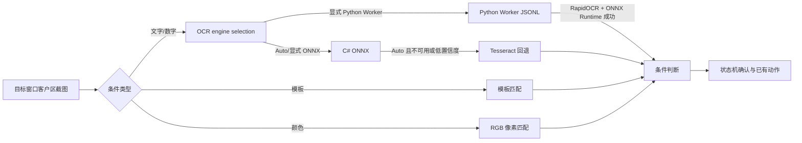

# 视觉识别架构

## 范围

本项目的视觉自动化只负责读取目标窗口客户区截图、识别状态并执行已有的鼠标动作。它不依赖上传的 Android APK 私有代码、私有模型或运行时资源，也不负责抓包、注入或发送网络数据。

## 识别链路



### OCR

- `VisionOcrEngine.Auto` 保留本地 ONNX/Tesseract 顺序；Python Worker 需要显式选择，避免冷启动模型加载阻塞原有识别流程。Worker 不可用时不伪造文本。
- 显式选择 `PythonWorker`、`Onnx` 或 `Tesseract` 时不切换引擎；Python Worker 缺少运行时或依赖会返回不可用，不伪造文本。
- ONNX 使用外部模型目录，默认是应用程序目录下的 `models\ocr`，需要 `det.onnx` 或 `dbnet.onnx`、`rec.onnx` 或 `crnn_lite_lstm.onnx`、以及 `keys.txt` 或 `character_dict.txt`。
- 如果模型不是默认的 RGB/`(value-0.5)/0.5` 预处理，可在同一目录放置可选的 `preprocess.json`（或 `ocr_preprocess.json`），分别配置 `detector`、`recognizer` 的 `colorOrder`、`mean`、`std` 和 `outputIsLogits`；模型文件或该 sidecar 变化后会自动重载。
- 识别输入会读取 ONNX 图像输入的 4D 形状、通道数和 NCHW/NHWC 布局；不支持的输入 rank 会明确返回错误，不会静默套用错误形状。
- 对 PaddleOCR 风格 CRNN，解码器按 `keys.txt` 不含 blank、输出第 0 类为 CTC blank 处理，同时保留 blank 在末类的兼容分支。
- ONNX 识别器只接受真实推理输出；模型缺失、输出不兼容或推理异常会返回不可用/失败结果，不会生成假文本。

### Python Worker 与 JSONL

- `vision_worker/worker.py` 是独立的长驻进程：C# 前端通过标准输入发送一行 JSON，Worker 通过标准输出返回一行 JSON；协议日志写标准错误，同时写入用户目录下的有限滚动日志文件。
- `VisionPythonWorkerTextRecognizer` 串行化请求、按超时/取消重启子进程，并把 RapidOCR 文本框、文本和置信度转换成现有 `VisionOcrResult`；现有截图、区域边界、状态机和动作授权仍由 C# 前端负责。
- Worker 的 `ocr` 使用 RapidOCR 的 ONNX Runtime CPU 推理；`capture` 使用 Airtest Windows 窗口句柄截图；`airtest_action` 只有请求显式设置 `allow_system_input=true` 时才允许输入。
- Worker 依赖安装到 `%LOCALAPPDATA%\XNAS\WPE\vision-worker\python`，不写入用户数据库，不把 Python 环境塞进 ClickOnce 包；应用输出携带脚本、依赖清单、模型清单和安装脚本。Worker 提供 warmup 健康检查、有限滚动日志和请求诊断。

示例（数值只是模型包提供者应确认的示例，不代表本项目内置模型）：

```json
{
  "detector": { "colorOrder": "RGB", "mean": [0.5, 0.5, 0.5], "std": [0.5, 0.5, 0.5], "outputIsLogits": false },
  "recognizer": { "colorOrder": "RGB", "mean": [0.5, 0.5, 0.5], "std": [0.5, 0.5, 0.5], "outputIsLogits": true }
}
```

## 截图、区域与动作安全

- 所有 profile、步骤和动作验证区域都会在实际目标窗口客户区尺寸上做边界检查；截图识别结果仍以区域左上角为原点，鼠标动作会转换回客户区坐标后再执行。
- 真实鼠标动作默认关闭；`Socket_RobotForm` 在每次含动作的运行前显示警告确认，`VisionAssistantRunner` 和 `VisionMouseAction` 同时执行运行级授权校验，未授权时 fail-closed。
- `Auto` 截图模式对非前台窗口优先使用窗口渲染；屏幕截图检测到空白/均匀画面时会尝试安全渲染，仍为空白则跳过识别，不会拿旧缓存误判。
- 失败截图只清理本功能生成的 `wpe_vision_*.png`，并保留最近 200 张；模板、模板变体、预览和运行 profile 的位图在替换、移除、运行结束和窗口关闭时释放。
- 视觉缓存使用完整位图指纹，不依赖稀疏采样；Tesseract 输入管道采用异步写入并受识别超时/取消控制，避免识别线程永久阻塞。
- 模板匹配在开始前估算候选位置与像素比较量，超过上限时返回终止型识别失败，并在像素比较过程中持续响应取消。
- 系统鼠标输入在发送前重新确认目标仍为前台窗口；机器人异常向 `RunWorkerCompleted` 传播，关闭编辑器会停止机器人并等待识别资源空闲后再释放。

### 固定客户区助手模式

- `VisionCaptureSettings` 支持 `RequireExactClientSize`、`RequiredClientWidth` 和 `RequiredClientHeight`。固定游戏助手使用 `1280×720` 客户区像素坐标；旧助手默认关闭固定尺寸校验并保持原有归一化坐标行为。
- 固定模式在启动前、每次截图前和每次动作前检查目标窗口身份、可见状态、非最小化状态和实时客户区尺寸；主区域、步骤条件区域、模板区域及动作验证区域必须位于客户区内。
- 尺寸不符或运行中改变尺寸会生成终止型视觉失败，状态机立即停止，不重试、不跳过、不使用旧截图执行动作。后台但可见的窗口继续使用现有 `Auto`/窗口渲染截图能力；最小化窗口不参与识别。
- 固定尺寸字段随 `RobotVisionProfile` 写入 SQLite，并随机器人 XML 的 `CaptureSettings` 导入导出；缺少新字段的旧数据按关闭固定模式兼容读取。
- WinForms 视觉设置提供固定客户区复选框、宽高、当前尺寸状态和“应用 1280×720 固定配置”按钮。启用固定模式时，保存配置会拒绝归一化区域，要求在 `1280×720` 截图上重新框选像素区域。

### 颜色条件

`VisionColorMatcher` 使用 `System.Drawing.LockBits` 扫描截图，按 RGB 三个通道的最大绝对差判断像素是否命中，并同时支持：

- 目标 RGB 颜色；
- 每通道容差；
- 最小命中像素数；
- 最小命中比例；
- `ColorAppears` 与 `ColorDisappears` 条件。

颜色条件经过 `VisionConditionEvaluator` 和现有确认次数、轮询间隔、超时、失败策略状态机后，才会触发已有动作。

## 与机器人指令集的集成

- 左侧视觉助手新增文字等待或图片等待步骤时，会同步生成右侧 `RInstruction` 中的 `VisionWait` 行。
- `VisionWait` 行使用 `VisionStep|索引|名称` 内容引用 `VisionProfile.AssistantSteps`；右侧指令集的上下移动、删除和清空会同步调整或移除视觉步骤。
- 视觉等待行可以和键盘、鼠标、延时、循环等原有指令混排；标准机器人执行时按右侧行顺序逐条执行视觉等待。
- 机器人指令表仍由现有 SQLite/XML 指令序列化保存，视觉步骤本体继续由 `RobotVisionCondition`/XML `VisionProfile` 保存。
- Hook 过滤器的延迟发送/机器人任务使用有界队列，并在 Hook 停止时取消正在等待或运行的任务；队列槽位会持续占用到实际任务结束，避免只限制启动瞬间。

## 配置与交付

- OCR 引擎、Python Worker 脚本/运行时路径、ONNX 模型目录、检测阈值、识别阈值和最大图像边长写入 `RobotVisionProfile`，并同步到 XML profile。
- 颜色条件写入 `RobotVisionCondition`，并同步到 XML assistant step。
- ONNX Runtime 使用 `Microsoft.ML.OnnxRuntime.Managed` 1.27.1；最终应用输出目录同时携带 x64 `onnxruntime.dll` 和 `onnxruntime_providers_shared.dll`。
- Python Worker 依赖由 `vision_worker/requirements.txt` 管理；`tools/Install-VisionWorker.ps1` 创建每用户环境并执行模型 SHA-256、`ping`、warmup 和 OCR 验收。
- 项目不内置 APK 中提取的模型。模型必须由使用者提供并确认其来源、许可证和适用性。
## Python Worker deployment boundary

The WinForms front end communicates with `vision_worker/worker.py` through
JSONL. Relative RapidOCR model paths resolve beside `worker.py`, and the
ClickOnce application package includes the three bundled ONNX files under
`vision_worker/models/ocr`; the worker refuses to download missing models.
RapidOCR preprocessing and threshold/filter settings are carried in the OCR
request, and returned boxes are mapped back to the captured source coordinates.

Airtest capture is selectable as a capture source. Airtest actions are used
only when the Python Worker engine is selected and require a short-lived,
one-shot, window-bound authorization token issued after the existing UI confirmation.
Python executable, worker script, and timeout settings persist in RobotVisionProfile
SQLite columns and the XML profile format.
