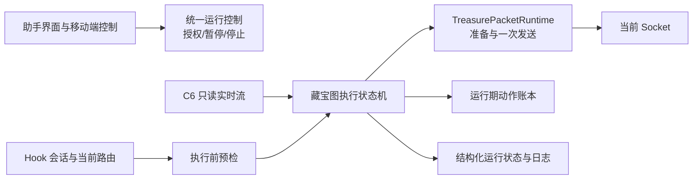

# 藏宝图助手安全状态机开发实施规格

版本：v1.0

日期：2026-08-21

状态：代码与隔离回归完成；真实业务验收未完成（不校验 Jump 到达，持续模式在 Use 后确认背包消耗）

适用范围：`WPELibrary` 中助手机器人的藏宝图指令、C6 藏宝图实时流、Jump/Use 封包准备与发送、桌面端和移动端运行控制，以及对应的自动化回归与真实环境验收。

## 1. 文档目的

本文件是后续开发 Agent 的实施依据。目标是在保留现有 C6 读取、纯编码和运行期真实发送闸门的基础上，把当前藏宝图流程从“无限重试的常驻发包循环”改造成“可暂停、可确认、可终止、不会盲目重复 Use”的安全状态机。

后续实现不得只根据本文件中的文件名机械改动；修改前仍需读取当前源码、项目规则、调用链和测试。若源码已与本文不一致，应先记录差异，再按本文的产品不变量选择最小实现。

## 2. 当前实现基线

### 2.1 已有链路

当前生产代码已经具备以下能力：

1. `Socket_RobotForm` 可以向助手指令集加入一条 `TreasureMap` 指令，并通过非持久化复选框传入本次运行的真实发送授权。
2. `Socket_Robot` 执行到 `TreasureMap` 时创建 `TreasureC6StreamClient` 和 `TreasureMapPresetRunner`。
3. C6 客户端连接默认端点 `127.0.0.1:28765`，校验协议、schema、序列、完整快照、进程身份、容器身份和当前成员事件。
4. 运行器按 `packageNum` 升序处理当前藏宝图成员。
5. `TreasurePacketRuntime` 根据当前 Hook 会话的出站路由直接编码：
   - Jump `0x5828`：`mapId/scene`、`x`、`y`；
   - Use `0x783A`：`packageNum -> pos`，固定高级藏宝图参数 `type=13`、`num=1`、`param="2"`。
6. 准备帧不保留旧 Socket；真正发送前重新解析当前会话的 Socket，并要求运行期 `TREASURE-LIVE-SEND` 授权。
7. Jump 成功后固定等待 300ms，再发送 Use；持续模式等待最多 1000ms 确认同一张图离开背包。未消耗时立即完整重试一次，仍未消耗则进入最长 3 秒的冷却确认；冷却中一旦消失立即继续，否则重试整套 Jump→Use，直到成功或用户停止。

### 2.2 当前主要缺口

| 缺口 | 当前表现 | 风险 |
|---|---|---|
| 没有游戏显式回执 | 当前以 C6 背包中原目标消失或同槽位版本变化作为消费确认 | C6 断线时不能把快照缺失误判为完成 |
| Use 结果不确定时可能重复 | 传输异常会清空已完成集合，重连后可再次处理仍存在的成员 | 非幂等 Use 可能重复执行 |
| 错误无分类且无限重试 | 未授权、协议错误、路由缺失等均可每秒重试 | 日志刷屏、持续占用机器人、错误状态下反复尝试 |
| 暂停不覆盖藏宝图内部 | 暂停门只在进入普通指令前等待 | 移动端显示已暂停时，藏宝图仍可能继续发送 |
| 指令没有退出语义 | 运行器持续等待新事件，正常情况下不返回 | 后续机器人指令永远不会执行 |
| 授权生命周期过宽 | 复选框不持久化，但同一窗口下一次执行仍可保持勾选 | “本次运行”与实际行为不完全一致 |
| 缺少运行状态模型 | 主要依赖文本日志 | 用户无法区分等待、暂停、失败、结果不确定和已确认完成 |

## 3. 目标与非目标

### 3.1 目标

1. 每张藏宝图都通过显式状态机执行，任何真实发送都只能发生在允许发送的状态。
2. Jump 后只按配置等待最短间隔，随后直接对 Jump 时确定的原槽位发送 Use；Use 前不做二次背包复核。
3. 持续模式在 Use `Dispatched` 后等待 C6 确认原目标已消失或同槽位已换图，再标记完成；一次模式保持发送完成语义。
4. 对“明确未发送”“已经发送”“发送结果不确定”进行区分；Use 一旦进入结果不确定状态，不得自动重发。
5. 桌面和移动端的暂停、恢复、停止语义保持一致；暂停完成后不得继续发送任何藏宝图封包。
6. 新增“一次处理当前快照”和“持续监听”两种明确模式；默认采用持续监听。
7. 保留当前 C6 fail-closed 校验、纯编码协议、当前会话路由和真实发送授权边界。
8. 不新增第三方依赖。

### 3.2 非目标

- 不改变 `0x5828`、`0x783A` 已闭合的字段布局和高级藏宝图固定参数。
- 不通过游戏 UI、鼠标、键盘或图像识别代替纯封包流程。
- 不从历史 JSON、历史捕获列表、上一次进程或上一次 Hook 会话恢复 Socket 和封包路由。
- 不让 C6 读取端获得动作权限；C6 继续保持 `actionAuthorized=false` 和只读职责。
- 不在本任务中发布 ClickOnce、创建版本、Git Tag 或真实发送游戏封包。
- 固定延时只用于控制 Jump 到 Use 的节奏，不宣称角色坐标已确认。

## 4. 产品不变量

以下规则优先于具体类名和实现方式：

1. **按目标重试**：Use 已发送但 C6 在确认窗口后仍明确显示同一目标时，必须重新执行完整 Jump→Use；不得脱离目标版本单独盲重发 Use。
2. **当前状态先于 Jump**：选择目标和发送 Jump 前必须具备当前目标证据、当前 Hook 会话和当前 Socket 路由；Jump 成功后不再用背包变化撤销后续 Use。
3. **消费确认先于持续完成**：Use 必须为 `Dispatched`，且持续模式必须确认原目标离开背包后才能完成；`Ambiguous` 不得自动继续。
4. **身份变化即失效**：C6 `streamSessionId`、进程身份、容器身份、Hook 会话代次任一变化，都撤销当前动作授权和未完成动作上下文。
5. **暂停后零发送**：暂停请求被运行时接受后，任何新 Jump/Use 都不得开始发送。
6. **停止优先**：停止必须中断连接等待、退避等待和 Jump 后最短等待，并释放 C6 连接。
7. **授权不持久化**：真实发送授权只属于单次 `runId`，不能写入助手预设、SQLite、XML、移动端快照或磁盘状态。
8. **结果不确定时停止**：不能把超时、断线或不完整证据解释成成功，也不能通过无限重试掩盖不确定状态。
9. **一条指令一个运行器**：一个助手预设最多包含一条藏宝图指令；持续模式必须是指令集最后一条。
10. **日志不泄漏封包正文**：只记录运行 ID、步骤、目标标识、错误码、重试次数、Socket 元数据和时间，不记录完整封包字节。

## 5. 目标架构

### 5.1 组件职责

| 组件 | 建议位置 | 职责 | 禁止承担 |
|---|---|---|---|
| 藏宝图运行控制 | `Lib/Vision` 新增小型类型，或并入通用机器人运行控制 | 提供取消、暂停等待、运行 ID、授权租约 | 不读取 C6，不编码封包 |
| 藏宝图状态机 | 重构 `TreasureMapPresetRunner.cs` | 选择目标、驱动状态转换、错误分类、超时和完成策略 | 不直接操作 WinForms 控件 |
| 动作账本 | `Lib/Vision` 新增运行期模型 | 记录目标身份、阶段、发送结果和证据；仅存在于当前运行内存 | 不跨进程持久化，不保存 Socket |
| 封包运行时 | `TreasurePacketRuntime.cs` | 当前会话代次、路由预检、编码、一次发送和结构化发送结果 | 不实现无限重试和业务完成判断 |
| 助手适配层 | `Socket_Robot.cs` | 将暂停/停止/授权/模式传入状态机，并发布运行状态 | 不复制状态机逻辑 |
| 桌面 UI | `Socket_RobotForm.cs` | 配置模式、显式授权、预检入口、状态展示、结束后撤权 | 不直接发包 |
| 移动端控制后端 | `MobileSync_Controller.cs` | 暂停/恢复/停止与结构化状态映射 | 不绕过桌面运行控制或授权 |

## 6. 运行身份与目标身份

### 6.1 运行代次

每次启动藏宝图指令生成新的 `runId`。运行上下文至少绑定：

- `runId`；
- 当前 Hook 会话代次；
- C6 `streamSessionId`；
- C6 `processIdentity`；
- C6 `containerIdentity`；
- 启动时的授权租约；
- 执行模式。

`TreasurePacketRuntime.BeginSession()` 应维护单调递增的 Hook 会话代次，并提供只读快照。只清空缓存而没有可比较的代次，无法让状态机可靠发现会话已变化。

### 6.2 目标键与目标版本

不得继续只用包含坐标的 `Fingerprint` 同时承担“物品身份”和“目标版本”两种职责。

建议拆分：

| 名称 | 字段 | 用途 |
|---|---|---|
| `TargetIdentity` | C6 会话/进程/容器身份、`memberIdentity`、`packageNum` | 判断是否仍为同一张物品 |
| `TargetRevision` | `TargetIdentity`、`scene`、`x`、`y` | 判断目标坐标是否发生变化 |

同一 `memberIdentity` 的坐标在 Jump 前变化时，可以更新仍处于等待阶段的目标；Jump 已经发送后固定使用 Jump 时冻结的槽位和目标版本，不再读取新的背包状态决定是否发送 Use。

## 7. 指令模式与兼容迁移

### 7.1 新模式

| 模式 | 行为 | 结束条件 |
|---|---|---|
| `CurrentSnapshot` | 取得首个完整且 ready 的 C6 快照，冻结其中的目标身份集合，依次处理 | 初始集合全部发送完成、集合为空、失败、结果不确定或用户停止 |
| `Continuous` | 持续消费新快照和成员事件 | 用户停止、失败或结果不确定 |

新建藏宝图指令默认使用 `Continuous`。用户仍可显式选择
`CurrentSnapshot`；保存校验要求 `Continuous` 位于指令集最后一行。

### 7.2 指令内容版本

新增一个集中式、版本化的藏宝图指令内容解析器。内容只保存安全的静态配置，例如模式和配置版本；不得保存真实发送授权、Socket、C6 身份或运行状态。

兼容规则：

- 旧内容 `treasure-map-pure-packet` 必须仍能读取。
- 为避免静默改变既有预设行为，旧内容按 `Continuous` 解释，但在编辑界面明确显示“旧版持续模式，建议重新保存”。
- 新增指令写入 v2 内容并默认 `Continuous`。
- 未知版本、未知模式或损坏内容必须让指令校验失败，不能回退为任一可发送模式。
- 用户重新保存旧指令时升级为 v2；不批量重写其他助手预设。

## 8. 执行状态机

### 8.1 状态定义

| 状态 | 含义 | 是否允许发送 |
|---|---|---:|
| `Idle` | 尚未启动 | 否 |
| `Preflight` | 校验授权、C6、Hook 会话、路由和配置 | 否 |
| `WaitingSnapshot` | 等待完整 ready 快照 | 否 |
| `SelectingTarget` | 按规则选择下一目标 | 否 |
| `PreparingJump` | 再次校验目标并准备 Jump | 否 |
| `SendingJump` | 进入一次 Jump 发送边界 | 仅 Jump |
| `WaitingAfterJump` | Jump 后等待配置的最短间隔 | 否 |
| `RevalidatingTarget` | 旧版保留状态，当前流程不进入 | 否 |
| `PreparingUse` | 准备当前目标 Use | 否 |
| `SendingUse` | 进入一次 Use 发送边界 | 仅 Use |
| `TargetCompleted` | 一次模式已发送 Use；或持续模式已确认原目标被消耗 | 否 |
| `WaitingNextTarget` | 持续模式等待新目标 | 否 |
| `Paused` | 已完成暂停握手 | 否 |
| `Stopping` | 正在取消等待和释放资源 | 否 |
| `Completed` | 一次模式正常结束 | 否 |
| `Failed` | 确定性失败 | 否 |
| `Ambiguous` | 已可能发送但无法确认结果 | 否，并且禁止自动恢复发送 |

### 8.2 主流程

1. 创建 `runId`，读取指令模式，取得本次运行授权租约。
2. 执行预检。任何不可恢复错误直接进入 `Failed`。
3. 连接 C6，等待完整 ready 快照，绑定 C6 会话、进程和容器身份。
4. 一次模式冻结首个快照中的目标身份集合；持续模式只维护当前成员视图。
5. 按 `packageNum`、`memberIdentity` 确定性排序选择目标。
6. 在 Jump 前检查暂停、停止、授权、Hook 代次、C6 身份、目标版本和当前路由。
7. 准备并发送一次 Jump，记录结构化发送结果。
8. 按配置等待 Jump 到 Use 的最短间隔（默认 300ms），不做角色到达证据校验。
9. Use 前不重新读取或复核 C6 目标；沿用 Jump 时冻结的目标槽位和版本。
10. 重新解析当前 Socket，准备并发送一次 Use。
11. 持续模式在 Use `Dispatched` 后等待最多 1000ms，确认原目标消失或同槽位版本变化。
12. 确认超时时立即完整重试一次；再次超时后进入最长 3 秒的持续确认，目标消失即提前结束冷却，否则重试整套流程；不标记假完成、不永久跳过。
13. Use 结果不确定时进入 `Ambiguous`；一次模式完成冻结集合后返回，持续模式仅在消费确认后处理下一目标。

### 8.3 暂停、恢复与停止

- 状态机在选择目标、每次准备、每次发送和每次退避前调用统一运行控制。
- 暂停请求必须等到当前代码离开发送临界区后才对外报告 `paused`。
- 如果暂停发生在 `WaitingAfterJump`，可以保留剩余等待并在恢复后继续，但不得发送新的动作。
- `Ambiguous` 不允许通过普通“恢复”继续；必须停止本次运行并由用户重新确认现场状态。
- 停止通过同一取消令牌关闭 C6 阻塞读取、Jump 后最短等待和退避等待。

## 9. Jump 节奏与完成规则

### 9.1 Jump 后节奏等待

当前流程不读取或验证角色坐标。Jump 发送结果为 `Dispatched` 后，运行器按
`JumpUseDelayMilliseconds` 等待最短间隔（默认 300ms），随后直接按 Jump 时冻结的
目标槽位准备 Use；仅在发送边界解析当前路由，不重新检查背包。固定等待只用于给游戏端留出处理时间，不
作为到达成功或业务完成的证明。

### 9.2 Use 完成规则

Use 发送结果为 `Dispatched` 后，一次模式立即完成；持续模式轮询由 C6 后台流更新的
当前快照，最长等待 1000ms。原目标消失或同槽位版本变化即视为已消费；同一版本仍在时
记录 `consume_timeout`，立即重试一次完整 Jump→Use。第二次及以后仍未消费则记录
`target_cooldown`，在最长 3 秒内持续检查背包；确认消费立即继续下一张，超时才再次重试，直到成功或用户停止。

## 10. 发送结果与重试策略

### 10.1 发送结果模型

现有布尔成功值不足以支撑非幂等 Use。发送边界需要提供结构化结果：

| 结果 | 含义 | 后续策略 |
|---|---|---|
| `NotDispatched` | 在调用底层发送前失败，能够证明没有任何字节进入发送调用 | 可以按策略重试 |
| `Dispatched` | 底层确认本次帧已提交 | 一次模式完成；持续模式继续等待背包消费确认 |
| `Ambiguous` | 已进入发送调用，但无法证明完整提交或完全未提交 | 立即进入 `Ambiguous`，禁止自动重发 Use |

如果底层 `Socket_Operation.SendPacket` 暂时无法区分部分发送和完全未发送，返回失败时必须按 `Ambiguous` 处理，不能假定为 `NotDispatched`。

### 10.2 错误分类

| 分类 | 示例 | 行为 |
|---|---|---|
| 启动阻塞 | 未授权、指令损坏、协议契约无效 | 不启动，显示明确错误 |
| 可恢复且未发送 | C6 尚未连接、尚无完整快照、当前路由暂不可用 | 有界退避重试 |
| 会话失效 | Hook 代次变化、C6 进程/容器身份变化 | 撤销授权并失败；动作后发生则进入 `Ambiguous` |
| 目标冲突 | 目标槽位、成员或坐标与动作上下文不一致 | 发送前失败；发送后进入 `Ambiguous` |
| 发送结果不确定 | 底层发送失败但不能证明零字节发送、发送后连接断开 | `Ambiguous`，不自动重试 Use |
| 用户控制 | 暂停、停止 | 分别进入 `Paused`、`Stopping` |

### 10.3 退避与超时默认值

默认值应集中定义、可被测试覆盖，但第一阶段不开放为持久化用户配置：

- C6/路由预检总时限：60 秒；
- Jump 明确未发送：250ms 短间隔，最多追加重试 2 次；结果不明确和 Use 均不自动重试；
- Jump 到 Use 的最短间隔：300ms；
- Use 后消费确认窗口：1000ms；首次超时立即完整重试，后续超时进入最长 3000ms 的可提前结束冷却；
- 日志对相同 `runId + state + code + target` 限频，状态变化时立即记录，重复等待最多每 15 秒记录一次。

具体数值如需调整，必须基于真实验收数据修改，并同步回归测试；不得散落硬编码在 UI、状态机和测试三处。

## 11. 执行前预检

真实发送开始前必须一次性返回结构化预检结果，至少包含：

- 指令版本和模式是否有效；
- 真实发送授权是否属于当前 `runId`；
- C6 是否连接、ready，并具有完整快照；
- C6 会话、进程和容器身份；
- 当前藏宝图数量和合法目标数量；
- Hook 会话代次；
- 当前出站游戏路由是否存在；
- 当前 Socket 是否可解析且仍有效；
- Jump/Use 编码契约是否闭合；
- 当前是否存在另一个藏宝图运行器。

预检不得发送任何游戏封包。未勾选真实发送时，桌面执行按钮应拒绝启动藏宝图真实流程并显示 `live_send_not_authorized`，不再启动一个每秒记录错误的后台循环。若需要诊断，提供独立“检查环境”入口，只运行预检。

## 12. UI 与运行状态

### 12.1 桌面端

藏宝图区域建议包含：

- “加入藏宝图流程”；
- 模式选择：“处理当前藏宝图后结束”／“持续监听新藏宝图”；
- “检查环境”；
- “允许藏宝图真实发送（仅下一次运行）”；
- C6、Hook、路由、目标数量和当前状态摘要。

真实发送授权的生命周期：

1. 默认关闭；
2. 启动时复制为绑定 `runId` 的运行期授权，并立即锁定复选框；
3. 启动失败、运行完成、停止、异常、窗体关闭、Hook/C6 身份变化后自动取消；
4. 不保存到助手预设；
5. 下一次运行必须重新勾选。

### 12.2 结构化状态

运行状态至少向桌面和移动端暴露：

- `runId`；
- 模式；
- 主状态和子步骤；
- 是否已暂停；
- 是否允许真实发送；
- 当前目标槽位、场景、坐标；
- 当前目标序号和总数；
- 最近错误码；
- 当前重试次数；
- Jump/Use 的发送结果类别；
- Use 完成状态；
- 开始时间和最后状态变化时间。

移动端只有在桌面运行时真正完成暂停握手后才能显示“已暂停”。`Ambiguous` 必须使用独立状态和明确提示，不能显示为普通失败、暂停或完成。

## 13. 预计修改范围

| 文件或模块 | 计划改动 |
|---|---|
| `WPELibrary/Lib/Vision/TreasureMapPresetRunner.cs` | 重构为显式状态机；移除无界同一步盲重试；接入账本、Use 完成、统一运行控制和两种模式 |
| `WPELibrary/Lib/Vision/TreasureC6StreamClient.cs` | 提供等待快照/成员变化所需的结构化结果；保持现有协议 fail-closed 规则 |
| `WPELibrary/Lib/Vision/TreasurePacketRuntime.cs` | 暴露 Hook 会话代次、结构化预检和三态发送结果；继续发送前解析当前 Socket |
| `WPELibrary/Lib/Socket_Robot.cs` | 把暂停、停止、运行 ID、授权和状态发布器传给藏宝图状态机 |
| `WPELibrary/Socket_RobotForm.cs` | 模式、环境检查、状态展示、授权一次性生命周期和完成后撤权 |
| `WPELibrary/Lib/Socket_Cache.cs` | 校验持续模式只能位于最后，保留最多一条藏宝图指令规则 |
| `WPELibrary/Lib/WebAPI/MobileSync_Controller.cs` | 映射真实暂停握手、`Ambiguous` 和结构化藏宝图运行状态 |
| `tests/TreasureC6StreamRegression/*` | 扩展状态机、重连、暂停、Use 完成和多图回归 |
| 新增专用回归脚本（如需要） | UI 授权重置、旧指令迁移、移动端运行状态契约 |

文件名可按当前工程模式调整，但不得把状态机分别复制到桌面、机器人和移动端三处。

## 14. 分批实施计划

### 批次 A：运行控制和指令语义

实施内容：

1. 增加版本化指令选项和旧内容兼容解析。
2. 增加一次/持续模式及保存校验。
3. 将机器人暂停门传入藏宝图内部。
4. 将真实发送授权绑定到单次 `runId`，结束后自动撤销。
5. 未授权时在启动前失败，不进入后台重试。

验证：旧预设可读、新预设默认一次模式、持续模式只能放最后、暂停后零发送、连续两次运行必须重新授权。

### 批次 B：状态机和动作账本

实施内容：

1. 引入目标身份/版本、状态枚举、动作账本和结构化运行状态。
2. 将当前 `RunTarget/SendStep` 改为显式状态转换。
3. 加入错误分类、有界退避、超时和日志限频。
4. C6 断线不再无条件清空已完成/已发送动作记录。

验证：每个转换均可由假流、假发送器和虚拟时钟确定性测试；取消不依赖真实等待。

### 批次 C：Use 完成与发送结果

实施内容：

1. Use 前不读取新的 C6 事件，不重新校验背包目标；沿用 Jump 时冻结的槽位和版本。
2. 持续模式在 Use `Dispatched` 后确认原目标已离开背包；未消耗时按完整目标重试策略处理。
3. 引入 `NotDispatched/Dispatched/Ambiguous` 发送结果。

验证：Jump 后不依赖到达证据即可按最短间隔进入 Use；Use 前不复核；持续模式只有在原目标消失或同槽位换图后完成，未消耗时先立即重试、再进入冷却重试。

### 批次 D：UI、移动端和诊断

实施内容：

1. 增加环境检查、模式选择和状态摘要。
2. 映射移动端暂停握手和 `Ambiguous` 状态。
3. 完成授权自动重置和日志限频。

验证：桌面与移动端显示同一运行状态；暂停、恢复、停止和错误提示与实际发送行为一致。

每个批次都应独立构建、独立回归，不能在状态机尚未闭合时用 UI 表象宣称全流程完成。

## 15. 自动化测试矩阵

### 15.1 状态机单元/隔离回归

| 场景 | 预期结果 |
|---|---|
| 未授权启动 | 启动前拒绝，发送次数为 0 |
| C6 未 ready | 只等待/退避，不发送 |
| 无 Hook 路由 | 预检失败或有界等待，发送次数为 0 |
| Jump 明确未发送 | 在限制内允许重试 |
| Jump 发送结果不确定 | 进入 `Ambiguous`，Use 次数为 0 |
| Jump 已发送且没有到达证据 | 不做该项校验，按最短间隔继续流程 |
| Jump 后目标槽位变化 | 不二次复核，仍按 Jump 时冻结槽位发送一次 Use |
| Jump 后 C6 进程/容器变化 | 不二次复核；当前发送边界仍必须取得有效 Socket 路由 |
| Use 明确未进入发送边界 | 可按限定策略重试 |
| Use 发送结果不确定 | 进入 `Ambiguous`，Use 总次数为 1 |
| Use 明确 `Dispatched` 且原目标消失 | 标记当前目标流程完成 |
| Use 明确 `Dispatched` 但原目标仍在 | 立即完整重试一次；再次失败后最长冷却 3 秒，目标消失立即继续，否则重试且不跳过 |
| C6 断线后目标仍存在 | 不清空账本，不重复 Use |
| 同槽位出现新 `memberIdentity` | 作为新目标，仅在模式允许时处理 |
| 同成员坐标在 Jump 前变化 | 更新待处理版本或重新选择 |
| 同成员坐标在 Jump 后变化 | 不影响已 Jump 目标的固定延时和一次 Use |
| 多张图一次模式 | 只处理首个完整快照冻结的集合并退出 |
| 多张图持续模式 | 处理新增成员并持续等待 |
| 一次模式结束后还有普通指令 | 机器人继续执行下一条指令 |
| 持续模式后存在普通指令 | 保存/启动校验失败 |

### 15.2 暂停与取消

必须分别在以下阶段触发暂停和停止：

- C6 连接中；
- 等待完整快照；
- 退避等待；
- Jump 前；
- Jump 后最短等待中；
- Use 发送前；
- 持续模式等待新成员。

验收要求：暂停确认后发送计数保持不变；恢复后从安全状态继续；停止在有界时间内完成且连接被释放。

### 15.3 UI 与兼容回归

- 新增指令默认一次模式。
- 旧 `treasure-map-pure-packet` 可以加载并显示迁移提示。
- 未知指令版本不能执行。
- 复选框不进入 SQLite/XML/移动端预设快照。
- 启动、失败、停止、完成、窗体关闭后复选框恢复未授权。
- 相同错误等待期间日志受到限频。
- `Ambiguous` 在桌面和移动端均有独立文案。

## 16. 构建与验证要求

实现 Agent 应从当前项目读取实际可用命令，并至少完成：

1. `WPELibrary` 与主解决方案的隔离 Debug 构建；
2. `TreasureC6StreamRegression`；
3. `TreasurePacketEncoderRegression.ps1`；
4. `TreasurePacketTemplatePatcherRegression.ps1`；
5. 助手机器人、持久化、安全和移动端协议相关既有回归；
6. 新增的暂停、Use 完成、结果不确定、指令迁移和授权重置回归；
7. `git diff --check`。

自动化测试必须使用假 C6 流、假发送器和可控时钟。测试不得连接真实游戏、不得注入真实目标、不得真实发送 Jump/Use。

## 17. 真实环境验收门槛

真实验收涉及目标注入和网络发送，必须由用户另行明确授权，并满足项目安全规则。自动化构建通过不能替代真实验收。

验收顺序：

1. 只读验证 C6 当前快照、身份和目标数量。
2. 验证当前 Hook 会话、当前路由和 Socket，不发送。
3. 使用专门准备的一张测试藏宝图执行单目标流程。
4. 保存 Jump 调用、Use 调用和发送结果的结构化时间线。
5. 确认同一目标 Use 真实发送次数严格为 1。
6. 再进行多图一次模式验收。
7. 最后进行持续模式、暂停、恢复、C6 重连和 Hook 会话变化验收。

全流程通过必须同时满足：

- 无游戏 UI 输入；
- 未使用历史 Socket 或历史路由；
- Jump 后按配置完成最短等待；
- Use 使用 Jump 时冻结的原槽位，期间不做二次背包复核；
- 每张图 Use 最多一次；
- 每张图的 Use 结果都明确分类；
- 暂停确认后零发送；
- 身份变化后授权立即失效；
- 没有把超时或断线记录为成功。

## 18. 完成定义

只有以下条件全部满足，才能把该优化标记为完成：

1. 状态机、运行控制和动作账本已经落地，不再由无限循环隐式决定行为。
2. 一次模式能正常返回，持续模式具有末尾指令校验。
3. 暂停、恢复、停止在藏宝图内部有效。
4. Use 沿用 Jump 时冻结的目标槽位，`Dispatched` 后立即完成当前目标流程。
5. Use 的不确定发送不会自动重试。
6. 真实发送授权绑定单次运行并自动撤销。
7. 桌面与移动端可以区分运行、暂停、失败、完成和结果不确定。
8. 所有自动化回归和构建通过。
9. 若没有完成真实环境验收，项目状态必须明确写“代码与隔离回归完成，真实业务验收未完成”，不得写成全流程已验证。

## 19. 实施纪律

- 默认最小改动，不顺手重构其他机器人、视觉、发送或移动端模块。
- 不新增第三方依赖；优先复用现有取消令牌、`ManualResetEventSlim`、C6 协议对象和路由解析能力。
- 不删除模板兼容路径或 resident JSON 兼容路径，除非另有明确任务和回归证明。
- 不修改已经闭合的封包字段、固定高级藏宝图参数或 C6 `actionAuthorized=false` 规则。
- 不通过降低测试、吞掉异常、延长无限等待或伪造证据让回归通过。
- 实施完成后，仅在事实确实变化时更新 `ARCHITECTURE.md` 和 `PROJECT_STATUS.md`。
