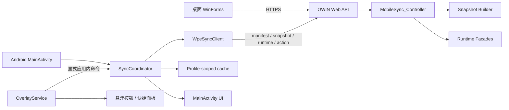

# WPE 模拟器端开发实施规格

版本：v1.6

本次修订：在局域网边界内为 `/MobileSync/*` 增加独立低权限代理账号认证，使用 Android Keystore 保护移动端密码，并补充凭据完整时的启动、进程重建和开机后的自动连接/悬浮服务恢复。

适用范围：雷电模拟器中的原生 Android 客户端、电脑端 `MobileSync` 接口及两端联调验收。

## 1. 目标与边界

### 1.1 产品目标

移动端只承担三类运行端职责：

1. 显示电脑端发送、递进、助手三类预设的完整只读信息，包括名称、序号、分组、顺序、代码/封包内容、发送次数、发送间隔及对应模块参数。
2. 请求电脑端开始、暂停、停止已选预设，并显示电脑端返回的运行状态；暂停后通过“开始”恢复同一个任务。
3. 在模拟器切换到其他应用后，通过右侧悬浮按钮继续执行常用控制。

电脑端 WinForms 仍是唯一的预设数据源、管理端和业务执行端。移动端可以缓存电脑端下发的完整只读快照，用于显示和发起运行请求，但不能编辑、覆盖或反向写回预设；移动端不执行抓包、注入、封包发送、滤镜或视觉识别。

### 1.2 已确认的同步策略

| 场景 | 是否拉取预设快照 | 说明 |
|---|---:|---|
| 当前移动端没有该电脑端的本地缓存，首次连接 | 是 | 自动完成一次初始化同步 |
| 已有缓存，Activity/服务自动重连 | 否 | 只验证连接、读取版本清单和运行状态；不自动替换本地完整快照 |
| 电脑端新增或修改预设 | 否 | 不得通过后台轮询自动替换移动端列表 |
| 悬浮面板点击“更新预设” | 按需 | 使用同一协调器先读 manifest，摘要变化后才拉 snapshot |
| 发送、递进、助手开始/暂停/停止 | 否 | 操作后只刷新 runtime，不刷新目录 |

这条规则是产品不变量：除“首次无缓存初始化”和用户明确点击“更新预设”外，任何后台任务都不能写入本地完整预设快照。更新成功后，目录、顺序、代码/封包内容、发送次数、发送间隔和其他参数必须作为同一个版本整体提交。

### 1.3 非目标

- 不把 Android 客户端改造成第二套预设编辑器；移动端展示的参数全部只读。
- 不让移动端形成第二套业务执行引擎；实际发送、递进和助手任务仍由电脑端执行。
- 不改变桌面端现有 WinForms 页面布局和业务入口。
- 不通过 HTTP 明文、自动降级重定向或管理员远程账号访问移动端接口。
- 不把“静态检查通过”当作真实模拟器、真实 HTTPS 或真实业务验收。

## 2. 总体架构



### 2.1 组件职责

| 组件 | 所在位置 | 只负责什么 | 禁止承担什么 |
|---|---|---|---|
| `MobileSync_Controller` | `WPELibrary/Lib/WebAPI/MobileSync_Controller.cs` | API 路由、输入校验、运行操作转发 | 不直接操作 Android UI |
| `MobilePresetSnapshotBuilder` | 同上 | 在一致快照上生成完整只读 DTO 和 revision | 不把桌面端 XML、认证信息或未列入协议的内部状态直接放入响应 |
| `Socket_Web` | `WPELibrary/Lib/WebAPI/Socket_Web.cs` | HTTPS 服务、MobileSync 局域网/低权限账号边界和其他路由管理员认证 | 不把 MobileSync 账号权限扩大到管理员路由 |
| `WpeSyncClient` | `mobile/.../WpeSyncClient.java` | HTTPS 请求、超时、状态码和响应读取 | 不决定何时同步、不修改 UI |
| `SyncStore` | 新增 Android 类 | profile 元数据、选中 ID、最近状态和快照版本指针 | 不发网络请求、不直接拼接完整快照 |
| `SnapshotStore` | 新增 Android 类 | 使用应用私有的版本化快照文件（允许 gzip）保存完整只读快照，并提供临时写入、校验后原子提交和回滚 | 不发网络请求、不提供编辑写回 |
| `SyncCoordinator` | 新增 Android 类 | 同步状态机、串行化、快照事务和错误映射 | 不直接创建 View |
| `MainActivity` | `mobile/.../MainActivity.java` | 透明启动、系统悬浮窗授权和服务恢复 | 不显示已退役配置页、不拼接 HTTP 协议细节 |
| `OverlayService` | `mobile/.../OverlayService.java` | 悬浮窗生命周期和按钮展示 | 不成为第二个网络客户端或预设仓库 |

当前实现已将同步、缓存事务、动作串行化和运行状态轮询集中到 `SyncCoordinator`；`MainActivity` 只负责透明启动、权限引导和服务恢复，退役配置内容永久隐藏；`OverlayService` 只负责悬浮窗生命周期与展示，不成为第二个网络客户端或预设仓库。

## 3. 端到端数据契约

### 3.1 认证与传输

- 所有移动端路由必须使用 HTTPS。
- `/MobileSync/*` 只允许局域网 peer，并要求独立低权限代理账号；其他 Web API 继续要求管理员远程管理账号。
- Android 禁止跟随重定向；重定向到 HTTP 或其他主机都视为失败。
- 客户端使用 Basic `Authorization` 请求头；账号明文只存在于输入/请求内存，密码持久化内容由 Android Keystore 的 AES/GCM 密钥保护。
- 日志只能记录主机、路由、HTTP 状态和错误类别，不得记录原始封包。

#### 3.1.1 标识、编码和参数语义

- `schemaVersion=2` 起，分组使用稳定的 `groupId`；`groupName` 只负责显示，不能作为关联键。每个类别分别提供分组列表及其 `sortOrder`，预设通过 `groupId` 归属分组。
- 为兼容当前桌面字段，`folder` 可以在过渡期保留，但 `groupId` 是唯一权威字段；分组改名或调整顺序不得改变 `groupId`。
- 电脑端迁移旧的 `SFolder`、`BFolder`、`RFolder` 时，必须为每个类别的旧分组生成并持久化一次 `groupId` 映射；不能每次同步根据名称临时生成。分组改名只更新名称，不重新生成 ID。
- 二进制数据网络传输只使用一种规范编码：`dataBase64`/`bufferBase64`。`dataHex` 只作为移动端显示值按字节转换生成，不能与 Base64 同时作为两个独立真值下发。
- `revision` 和 `payloadSha256` 都基于规范化快照正文计算；计算输入不包含 `generatedAt`、`payloadBytes`、`revision` 和 `payloadSha256` 自身，并按类别、分组顺序、预设顺序和稳定 ID 固定序列化，避免字段顺序造成假更新。
- `payloadBytes` 表示规范化快照正文的 UTF-8 字节数；如果传输启用 gzip，大小校验仍以解压后的规范化正文为准。
- 规范化序列化必须由电脑端和 Android 端共用协议规则，并提供固定 JSON 测试向量；禁止直接使用两端默认 JSON 序列化结果计算哈希。
- `intervalMs`、`nextIntervalMs` 和所有间隔字段统一使用非负整数毫秒；`loopCount=0` 表示连续发送，正整数表示有限次数。
- 普通发送预设中，一轮是按保存顺序完整遍历一次封包集合；`intervalMs` 表示每个封包发送完成后到下一个封包开始前的等待时间，不是整轮之间的间隔。
- `sortOrder` 从 1 开始，并且只在同一类别、同一分组内解释；同序号时使用稳定 ID 做确定性排序。
- 所有 GUID、计数、间隔、长度和范围字段都必须做范围校验；非法字段使本次快照失败，不得静默改成默认值后提交。

### 3.2 Manifest

请求：`GET /MobileSync/manifest`

目标响应（`schemaVersion=2`）：

```json
{
  "schemaVersion": 2,
  "revision": "sha256-lowercase-hex",
  "payloadSha256": "sha256-lowercase-hex",
  "payloadBytes": 12345,
  "generatedAt": "2026-08-07T00:00:00Z",
  "sendCount": 3,
  "progressionCount": 2,
  "assistantCount": 1
}
```

可选字段：

```json
{
  "serverInstance": "opaque-id",
  "serverVersion": "desktop-version",
  "minClientVersion": "mobile-version",
  "capabilities": [
    "fullSnapshot",
    "expectedRevision",
    "requestDedup",
    "gzipSnapshot"
  ]
}
```

客户端不得因为未知字段而失败；`revision` 为空或不是 64 位十六进制字符串时，manifest 视为无效。
`schemaVersion` 高于客户端支持版本时，客户端必须拒绝替换快照并提示升级；`payloadSha256` 必须是 64 位十六进制字符串，`payloadBytes` 必须为正整数且不超过客户端配置上限。
缺少 `fullSnapshot` 或 `expectedRevision` 能力时，客户端不得把旧目录接口伪装成完整同步；应显示电脑端版本不兼容，并保留当前缓存。

### 3.3 Snapshot

请求：`GET /MobileSync/snapshot`

响应：

```json
{
  "schemaVersion": 2,
  "revision": "sha256-lowercase-hex",
  "payloadSha256": "sha256-lowercase-hex",
  "generatedAt": "2026-08-07T00:00:00Z",
  "sendGroups": [
    { "id": "group-guid", "name": "分组", "sortOrder": 1 }
  ],
  "progressionGroups": [
    { "id": "progression-group-guid", "name": "分组", "sortOrder": 1 }
  ],
  "assistantGroups": [
    { "id": "assistant-group-guid", "name": "分组", "sortOrder": 1 }
  ],
  "send": [
    {
      "id": "guid",
      "groupId": "group-guid",
      "groupName": "分组",
      "name": "预设名称",
      "sortOrder": 10,
      "enabled": true,
      "systemSocket": false,
      "loopCount": 3,
      "intervalMs": 1000,
      "notes": "",
      "packets": [
        {
          "packetType": "tcp-send",
          "from": "127.0.0.1:1000",
          "to": "127.0.0.1:2000",
          "length": 4,
          "dataBase64": "qrvM3Q=="
        }
      ]
    }
  ],
  "progression": [
    {
      "id": "guid",
      "groupId": "progression-group-guid",
      "groupName": "分组",
      "name": "递进预设",
      "sortOrder": 20,
      "enabled": true,
      "mode": "sequential",
      "loopCount": 1,
      "intervalMs": 100,
      "nextIntervalMs": 500,
      "range": { "start": 0, "length": 1 },
      "packetType": "tcp-send",
      "from": "127.0.0.1:1000",
      "to": "127.0.0.1:2000",
      "bufferBase64": "qrvM3Q==",
      "byteAnnotations": []
    }
  ],
  "assistant": [
    {
      "id": "guid",
      "groupId": "assistant-group-guid",
      "groupName": "分组",
      "name": "助手预设",
      "sortOrder": 30,
      "enabled": true,
      "instructions": [],
      "visionProfile": null
    }
  ]
}
```

约束：

- 三个数组必须存在；没有项目时返回空数组而不是 `null`。
- `id` 必须是非空 GUID；同一类别内不得重复。
- `groupId` 必须是非空 GUID，并且必须存在于对应类别的分组数组；`groupName` 只用于显示。过渡期的 `folder` 只作为兼容字段，不参与关联。
- `name` 可以为空；客户端使用 GUID 作为最终回退显示文本。
- 每个类别的分组 ID、预设 ID 都不得重复；预设排序必须能在同一分组内稳定重建。
- 客户端保存完整只读快照，不保存或解析桌面端 XML；未知字段必须忽略但不能导致整份快照失败。
- 三个类别都必须保留电脑端的稳定 ID、名称、分组、序号/排序和该类别完整参数。
- 发送预设至少包含启用状态、系统 Socket 标记、发送次数、发送间隔、备注和封包集合；封包集合保留封包类型、源地址、目标地址、长度和规范化 Base64 字节数据，移动端按需生成十六进制显示。
- 递进预设至少包含原始封包、递进模式、范围、循环次数、递进间隔、下条预设间隔、双字节组合参数、封包地址信息和字节注释。
- 助手预设至少包含启用状态、指令顺序、指令参数、分组和已配置的视觉助手参数。
- 移动端主界面至少只读显示发送预设的发送次数和发送间隔；展开详情时可显示该预设的其他同步参数。
- 不在移动端显示或缓存密码、远程管理账号、桌面端窗口状态等非预设信息。
- `snapshot.schemaVersion` 必须等于客户端支持的版本；`snapshot.revision` 必须等于本次 manifest revision，且规范化快照内容的 SHA-256 必须等于 `payloadSha256`；否则不得覆盖旧缓存。

### 3.4 Runtime

请求：`GET /MobileSync/runtime`

当前兼容结构：

```json
{
  "send": { "starting": false, "running": false, "stopping": false, "presetId": "guid" },
  "progression": { "jobId": "guid", "presetId": "guid", "state": "Running", "isBusy": true },
  "assistant": { "starting": false, "running": false, "stopping": false, "presetId": "guid" }
}
```

客户端必须兼容大小写差异和缺失的可选字段。后端第二阶段统一为：

```json
{
  "state": "idle|starting|running|pausing|paused|stopping|completed|cancelled|faulted",
  "starting": false,
  "running": false,
  "pausing": false,
  "paused": false,
  "stopping": false,
  "presetId": "guid-or-empty",
  "jobId": "guid-or-empty",
  "revision": "sha256-or-empty",
  "startedAt": "2026-08-07T00:00:00Z",
  "finishedAt": "2026-08-07T00:00:00Z",
  "completedCount": 0,
  "totalCount": 0,
  "errorCode": "",
  "detail": "safe-user-facing-detail",
  "updatedAt": "2026-08-07T00:00:00Z"
}
```

`jobId`、`presetId` 和 `revision` 必须在一次运行期间保持不变；暂停、恢复不会生成新的 `jobId`，并且必须保留已有进度。电脑端重启或任务状态无法确认时，移动端显示“状态未知/请重新连接”，不能直接显示“已停止”。`completedCount` 和 `totalCount` 没有可靠值时返回 `null` 或 0，并由客户端按状态区分“无进度”和“已完成”。

### 3.5 操作响应和错误

开始、恢复、暂停和停止请求必须携带模拟器当前显示的预设版本：

```json
{
  "expectedRevision": "sha256-lowercase-hex",
  "requestId": "opaque-id"
}
```

电脑端必须在开始、暂停或恢复前校验 `presetId`、`expectedRevision` 和预设有效性。版本不一致时不得执行旧界面对应的请求，返回 `preset_revision_mismatch`，由模拟器提示先更新预设。暂停和停止请求必须携带当前 `jobId`，并且对同一任务按幂等操作处理；重复暂停不能创建新任务，重复停止不能误停后续任务。暂停中的任务只能通过同一预设的“开始”请求恢复。

目标动作接口按模块统一为：`POST /MobileSync/{send|progression|assistant}/{id}/start`（空闲时开始，暂停时恢复）、`POST /MobileSync/{send|progression|assistant}/{id}/pause`（暂停当前 `jobId`）和 `POST /MobileSync/{send|progression|assistant}/stop`（停止当前 `jobId`）。三类动作都携带 `expectedRevision` 与 `requestId`；暂停/停止还必须携带 `jobId`。本版实现必须提供 pause 路由和暂停 runtime 状态；接口存在不等于真实 HTTPS 与电脑端业务联调已经验收。

同一移动端 profile 内，`requestId` 在服务端保留一个有限时间窗口的结果。网络超时后使用同一个 `requestId` 查询/重放不会创建第二个任务；相同请求返回原来的 `jobId` 和 accepted 结果。新的启动请求必须使用新的 `requestId`。

成功响应至少包含：

```json
{ "accepted": true, "id": "guid", "jobId": "guid-or-empty", "revision": "sha256-lowercase-hex", "action": "send-start|send-resume|send-pause|send-stop" }
```

错误响应应逐步统一为：

```json
{
  "code": "runtime_busy",
  "message": "当前已有任务运行",
  "retryable": false,
  "requestId": "opaque-id"
}
```

至少统一以下业务错误码：`preset_revision_mismatch`、`preset_not_found`、`preset_invalid`、`runtime_busy`、`runtime_not_connected`、`runtime_route_ambiguous`、`pause_not_allowed`、`pause_not_found`、`stop_not_found`。开始接口默认不自动重试；暂停和停止接口可安全重复提交，但必须以最终 runtime 为准。

兼容当前纯文本/框架错误时，客户端按 HTTP 状态先分类，再把响应正文截断为安全的短提示。

## 4. 同步状态机

### 4.1 状态

| 状态 | 含义 | 允许的用户操作 |
|---|---|---|
| `NO_PROFILE` | 尚未建立 endpoint profile | 使用保存地址或默认地址自动连接 |
| `CACHED_OFFLINE` | 有本地完整快照，但当前未连通 | 查看缓存、连接、重试；开始/暂停/停止操作禁止假装成功 |
| `CONNECTING` | 正在连接并读取 manifest/runtime | 禁止重复连接 |
| `CONNECTED_CACHED` | 已连接，显示本地完整快照 | 更新预设、开始/暂停/停止 |
| `UPDATE_CHECKING` | 用户主动检查 manifest | 禁止重复更新 |
| `UPDATING` | 正在获取并校验完整 snapshot | 禁止启动新的快照更新 |
| `SYNCED` | 本地完整快照与最近一次快照一致 | 开始/暂停/停止、再次更新 |
| `UPDATE_AVAILABLE` | 电脑端 revision 与本地不同 | 只有点击更新才替换完整快照 |
| `ACTION_PENDING` | 已提交开始/暂停/停止，等待 runtime | 按当前 jobId 防重复提交；预设选择锁定 |
| `ERROR` | 最近一次操作失败 | 查看安全错误、重试 |

### 4.2 必须满足的转换

```text
NO_PROFILE --connect--> CONNECTING
CONNECTING --no local revision--> UPDATING --valid snapshot--> SYNCED
CONNECTING --local revision--> CONNECTED_CACHED
CONNECTED_CACHED --manifest differs--> UPDATE_AVAILABLE
UPDATE_AVAILABLE --manual update--> UPDATING --valid snapshot--> SYNCED
UPDATING --invalid/mismatch/error--> previous state + ERROR message
CONNECTED_CACHED/SYNCED --action with expectedRevision--> ACTION_PENDING --runtime--> same snapshot state
CACHED_OFFLINE --action--> ERROR (must connect; do not claim success)
```

### 4.3 快照事务算法

```text
manualUpdate(reason):
  acquire snapshot mutex; if unavailable return BUSY
  manifestA = GET manifest
  if reason == CONNECT_WITH_CACHE:
      GET runtime
      publish UPDATE_AVAILABLE or CONNECTED_CACHED
      release mutex
      return
  if localRevision == manifestA.revision and localPayloadSha256 == manifestA.payloadSha256 and localSnapshotValid() and reason != INITIAL_NO_CACHE:
      GET runtime
      publish SYNCED
      release mutex
      return
  repeat at most 3 times:
      snapshot = GET snapshot
      validate schema, group IDs, arrays, GUID uniqueness, field ranges, encoding, payload size and snapshot.revision
      manifestB = GET manifest
      if snapshot.revision == manifestB.revision and sha256(canonical(snapshot)) == manifestB.payloadSha256:
          parse all categories off the UI thread
          publish one immutable full snapshot object to UI
          write full snapshot to SnapshotStore temporary version
          commit SnapshotStore transaction and atomically advance profile version pointer
          GET runtime
          publish SYNCED
          release mutex
          return
  keep previous complete snapshot and revision
  publish ERROR("电脑端预设在更新期间持续变化，请稍后重试")
  release mutex
```

任何异常都必须在 `release mutex` 前清理 `inFlight` 标记。更新失败不能清空旧缓存，不能把半解析结果写入 SnapshotStore 或 SharedPreferences，也不能重置用户选中的预设。只有新快照提交成功后，才允许更新轻量版本指针。

### 4.4 完整字段与运行显示

- `SyncCoordinator` 提交的对象必须同时包含分组树、预设顺序和预设详情，不能只提交名称、分组、序号三个目录字段。
- 发送预设被选中后，移动端以只读方式显示：预设名称、分组、电脑端序号、发送次数、发送间隔；可展开查看封包代码/十六进制内容和其他参数。
- `开始`、`暂停`、`停止`、`更新预设`只改变运行状态或本地缓存版本，不改变快照中的任何预设字段。
- 点击“更新预设”后，旧快照继续用于显示，直到新快照的所有类别、参数和校验均通过；通过后一次性切换到新快照。
- 电脑端修改名称、顺序、分组、代码、发送次数或发送间隔，必须改变 `revision`，确保移动端不会误认为仍是旧版本。
- 开始、暂停和恢复请求必须携带当前 `revision`；电脑端发现版本过期时拒绝执行并要求更新，不能让“模拟器显示值”和“电脑端执行值”脱节。

## 5. 缓存与选择持久化

### 5.1 Profile 隔离

缓存必须按电脑端身份隔离，避免切换电脑端后显示另一台电脑的预设：

```text
profileKey = SHA-256(canonicalHttpsEndpoint + "\n" + mobileUsername)
```

每个 profile 保存：

```text
profile.<key>.revision
profile.<key>.payloadSha256
profile.<key>.sendGroups
profile.<key>.progressionGroups
profile.<key>.assistantGroups
profile.<key>.snapshotVersion
profile.<key>.snapshotStorageKey
profile.<key>.selectedSend
profile.<key>.selectedProgression
profile.<key>.selectedAssistant
profile.<key>.lastSyncAt
```

移动端凭据不参与快照内容，但 profile 必须保存移动端账号标识，并由 `SyncStore` 使用 Android Keystore 加密保存密码。切换 endpoint/profile 时先加载新 profile 的缓存；没有缓存就展示空目录和“首次连接将同步”，不能继续展示旧电脑的列表。凭据不完整时不得自动连接或隐藏配置入口。

上述轻量键只保存版本指针、分组摘要和选择状态；完整发送/递进/助手详情由 `SnapshotStore` 按 `profileKey + snapshotVersion` 保存。新版本提交完成前，旧 `snapshotStorageKey` 必须保持可读。

### 5.2 选择恢复规则

1. 先按 GUID 恢复原选择。
2. GUID 仍存在时，名称、分组、序号或发送参数变化不影响选择；详情显示最新快照中的值。
3. GUID 被删除时选择该类别第一项，并更新持久化选择。
4. 类别为空时清除该类别选择。
5. 快照更新期间 UI 暂停提交选择，更新完成后再恢复；分组改名或排序不会改变按 GUID 记录的预设选择。

## 6. 悬浮窗实现规格

### 6.1 生命周期

- `OverlayService` 使用 `TYPE_APPLICATION_OVERLAY`，Android O 以上必须走 `startForegroundService` 并在创建后立即 `startForeground`。
- 需要 `SYSTEM_ALERT_WINDOW`、`FOREGROUND_SERVICE` 和 `FOREGROUND_SERVICE_SPECIAL_USE` 权限。
- 服务只管理窗口，不拥有同步缓存和业务状态。
- 透明 Activity 退到后台时，若悬浮服务仍运行，只保留 runtime 轮询；不启动目录轮询。
- 权限被撤销、窗口添加失败或系统回收时，服务要安全移除 View；下次启动只引导 Android 系统悬浮窗权限，不显示配置内容。

### 6.2 交互

- 收起态：右侧一个约 56dp 的圆形六点悬浮按钮。
- 收起态悬浮按钮只保留三种视觉状态：普通（未运行/已停止）、发送中、暂停中；不在悬浮球上增加同步中、停止中或异常的第四类图标状态。同步失败、停止中和异常通过展开面板内的状态文案提示。
- 发送中显示绿色悬浮球和暂停图标“Ⅱ”；暂停中显示橙黄色悬浮球和播放/继续图标“▶”；普通状态保持深色六点悬浮球。图标表示下一步可执行动作，不是当前状态的文字替代。
- 展开态：无桌面标题栏和最小化/关闭按钮的单层半透明面板。顶部横向放置三个较大的主操作按钮，固定顺序为“开始”“暂停”“停止”，并占用原说明文字所在的上方区域；中部直接展示分组和预设树，不显示“发送分组”或说明性副标题；下方使用一行紧凑的选中预设只读摘要；最底部放置更小的四个功能入口“发送”“递进”“助手”“更新”。
- 三个主操作按钮要明显大于底部四个功能入口，但不能变成占满面板的卡片；按钮必须保留不少于 44dp 的实际触摸区域。
- “开始”在空闲态启动当前选中的预设，在暂停态恢复当前任务；“暂停”只在启动中或运行中可用；“停止”只结束当前任务，不弹出二次确认。启动中、暂停中和停止中按 runtime 状态防止重复提交。
- 任务处于启动中、运行中、暂停中或停止中时锁定预设选择，详情继续显示实际运行的 `presetId`；任务结束或失败后恢复选择。这样不会出现“界面选中预设二但停止按钮实际停止预设一”的歧义。
- 底部四个功能入口只负责切换发送、递进、助手和更新模块，不承担当前任务的开始/暂停/停止；“更新”仍是完整快照替换的唯一入口。
- 点击悬浮球、面板外区域或收起按钮只切换面板显示，不发送开始、暂停或停止命令；面板收起后，电脑端任务继续按原状态运行。
- 收起期间 `OverlayService` 和 `SyncCoordinator` 继续保留任务关联并读取 runtime；再次展开时按电脑端实际状态恢复按钮可用性和悬浮球图标。停止请求未获确认前保持原来的发送/暂停视觉状态，确认停止后恢复普通悬浮球。
- 面板内点击不穿透。
- 所有按钮最小触摸高度 44dp，并设置 `contentDescription`。
- 面板可以显示完整的分组/预设列表；选中发送预设后至少显示名称、序号、发送次数和发送间隔。所有详情只读，不出现新建、编辑、删除、重命名、排序或保存入口。
- `更新`只检查并替换完整预设快照；“开始”“暂停”“停止”只控制电脑端当前任务，并不修改预设数据。
- 命令必须带应用包名或显式组件，禁止导出可被其他应用伪造的广播。

### 6.3 命令一致性

悬浮面板发出的开始、暂停、停止和更新命令必须进入同一个 `SyncCoordinator`，不能在 `OverlayService` 中复制业务逻辑；悬浮球本身只负责展开/收起，不产生业务命令。Activity 重建期间应保证命令不静默丢失：至少保留最近一条未处理命令的短期队列，并以命令 ID 去重。

## 7. 网络与错误处理

### 7.1 客户端

`WpeSyncClient` 后续应补齐：

- `HttpResult`/`WpeHttpException`，区分状态码、超时、TLS、解析和业务错误。
- 响应体最大字节数，避免异常服务端导致无限读取。
- 完整 snapshot 以 `payloadBytes` 做预检，并设置服务端/客户端一致的最大快照大小；允许 HTTPS gzip 压缩，但校验必须针对解压后的规范化内容，禁止截断后提交。
- GET 与运行控制 POST 均最多两次短退避重试；每次运行控制请求复用同一 `requestId` 和请求体，服务端按操作与请求 ID 原子去重，避免启动重试创建第二个任务。
- URL 只允许当前协议和固定相对路由，拒绝 `..`、空路径和跨主机构造。
- 401/403 显示“电脑端版本仍要求登录，请更新桌面端”；404 显示“电脑端版本未提供移动接口”；409/400 显示业务冲突；TLS/超时显示网络配置建议。
- 每次请求都在 finally 中断开连接；Activity 销毁后不得再更新 View。

### 7.2 服务端

- `/MobileSync/*` 在局域网内要求独立低权限代理账号；认证中间件必须精确匹配该路由前缀，其他 Web API 继续使用管理员认证。
- 启动发送、递进、助手前都要校验 GUID 存在且预设有效。
- 启动发送、递进、助手前都要校验 `expectedRevision`；版本不一致返回 `preset_revision_mismatch`，不得执行客户端旧快照对应的请求。
- 运行中的冲突统一返回可识别的业务错误，不依赖英文异常文本作为客户端逻辑条件。
- `MobilePresetSnapshotBuilder` 必须在桌面端受控线程边界内深度复制封包字节、封包集合、字节注释、递进缓冲区、助手指令和视觉配置，生成不可变快照；不能把正在被 WinForms 编辑的集合引用直接交给序列化线程。
- revision 计算和 snapshot 生成必须基于同一份一致的完整预设快照；任何名称、分组、顺序、代码/封包内容、发送次数、发送间隔或其他参数变化都必须改变 revision。
- snapshot 响应使用版本化的 allowlist DTO 传输完整只读预设信息，不直接暴露桌面端 XML；二进制封包传输统一使用 Base64，十六进制只由客户端按需生成显示，校验后再缓存。
- 快照接口不得只返回目录字段后声称“已同步”；目录和详情字段必须同版本、同校验值、一次性提交。
- 完整快照的原始封包、助手指令和视觉参数属于敏感只读数据；不得写入日志，并应使用 Android 应用私有存储缓存。
- `GetManifest()` 和 `GetSnapshot()` 不应在没有必要时重复执行昂贵的完整 XML 序列化；稳定后可引入带失效通知的内存快照缓存，但不能牺牲保存后立即可更新的正确性。

## 8. UI 结构与状态文案

### 8.1 隐藏 Activity 与悬浮面板

`MainActivity` 使用透明窗口，配置内容根节点永久为 `GONE`，任何生命周期或悬浮命令都不得把它改回可见。没有悬浮窗权限时只打开 Android 系统授权页；授权后立即启动 `OverlayService` 并退回游戏。同步、选择、更新和运行控制全部通过悬浮面板完成。

### 8.2 文案规则

- 连接由 Activity、粘性服务或开机恢复自动完成，不提供账号、密码或手动连接页面。
- “更新预设”是唯一的完整预设快照替换动作入口。
- “发送次数”和“发送间隔”是电脑端同步来的只读值，移动端不提供编辑控件。
- “运行状态”与“预设同步状态”分开显示。
- 断网时可以继续查看带版本号的上次完整快照，但开始、暂停、停止和助手控制不得显示为成功；恢复连接后先刷新 runtime，再由用户决定是否更新预设。
- 版本过期时显示“电脑端有更新，请先更新预设”，开始、暂停和停止按钮不可提交旧版本对应的动作。
- 失败消息给用户可执行的下一步，不直接展示完整 JSON、堆栈或认证头。

### 8.3 悬浮面板布局

最终参考图：[simulator-overlay-final-v1.5.png](docs/references/simulator-overlay-final-v1.5.png)


```text
[开始] [暂停] [停止]                 ← 顶部较大执行控制

[常用]                         >
[战斗]                         v
  [预设一]                      ← 当前选中
  [预设二]
  [预设三]
[采集]                         >
[其他]                         >

[预设一 · 序号01 · 次数3轮 · 间隔1000ms · ● 已同步·待发送]

[发送]       [递进]       [助手]       [更新] ← 底部小型功能入口
```

- 中部列表是面板的主要空间，分组可以展开，子预设行不显示三角或其他展开符号；只有分组行显示展开状态。
- 不显示“发送分组”、电脑端管理说明或其他解释性标题；个人使用场景直接进入分组和预设列表。
- 预设详情压缩为一行只读摘要，显示电脑端同步来的名称、序号、发送次数、发送间隔和状态；不出现新建、编辑、删除、保存或本地覆盖入口。
- 空闲态显示“开始”为可用主按钮，“暂停”和“停止”为不可用的中性按钮；运行态按 runtime 切换可用性，不能通过按钮颜色推断未确认的成功状态。
- 底部功能入口保持较小，并固定在面板底部，避免与中部预设列表争夺主要视觉空间。

### 8.4 悬浮球状态与收起行为

| 悬浮球显示 | 颜色 | 中心图标 | 含义 |
|---|---|---|---|
| 普通 | 深灰/低强调 | 默认六点 | 未运行或电脑端已确认停止 |
| 发送中 | 绿色 | 暂停“Ⅱ” | 当前任务持续发送，下一步可暂停 |
| 暂停中 | 橙黄色 | 播放/继续“▶” | 当前任务已暂停，下一步可恢复 |

- 悬浮球图标按“下一步动作”解释：发送中显示暂停，暂停中显示继续。
- 悬浮球点击只展开或收起面板，不能直接执行图标所提示的动作；真正的开始、暂停和停止仍通过面板顶部按钮完成。
- 停止确认后恢复普通六点悬浮球；不额外显示红色停止状态。

## 9. 开发拆分与文件落点

### 阶段 A：基础设施

1. 补齐 Gradle Wrapper，固定 Gradle、AGP、JDK、compileSdk 版本。
2. 新增 `SyncModels.java`：Manifest、GroupInfo、完整 Snapshot、只读 SendDetail/ProgressionDetail/AssistantDetail、RuntimeStatus、ActionResult、SyncError。
3. 新增 `SnapshotStore.java`：应用私有版本化快照文件、临时文件、哈希校验、fsync/原子替换和旧版本回滚。
4. 新增 `SyncStore.java`：profile key、快照版本指针、选择读写和轻量状态元数据；SharedPreferences 只保存这些小字段。
5. 新增 `SyncCoordinator.java`：状态机、快照事务、串行队列、runtime 轮询和 action requestId 去重。
6. 将 `MainActivity` 的网络和缓存代码迁移到协调器，Activity 只订阅状态并更新 View。

### 阶段 B：协议与后端加固

1. 在 `MobileSync_Controller.cs` 增加完整只读快照 DTO、GroupInfo、统一错误 DTO、schemaVersion、expectedRevision 和输入校验。
2. 统一三类 runtime 的状态字段，保留当前字段作为兼容期输出。
3. 增加 revision/snapshot 一致性、完整字段哈希、GUID 重复和发送次数/发送间隔映射测试。
4. 检查 `WPELibrary.csproj`、Web API 路由注册、HTTPS 启动/停止生命周期。

### 阶段 C：悬浮窗与 UI

1. 保留 `OverlayService` 的窗口实现，移除其中任何业务判断。
2. 增加命令 ID、短期待处理队列和重复命令保护。
3. 透明 Activity 实现凭据完整时的自动连接、权限引导和服务恢复；更新、runtime 与选择状态只在悬浮面板展示。
4. 复查 720p 模拟器、窄屏和系统字体放大下的面板可点击性。

### 阶段 D：可验证交付

1. Android 单元测试：JSON 解析、revision 校验、快照事务、profile 隔离、选择恢复。
2. 后端回归：manifest/snapshot/runtime/开始/暂停/停止、MobileSync 局域网/低权限账号边界、其他路由管理员认证和错误码。
3. Android Lint、Debug APK、Release APK 构建。
4. 雷电模拟器安装和手工点击验收。
5. 记录真实 HTTPS、MobileSync 认证边界、桌面远程服务开关和未执行的真实业务边界。

## 10. 测试与验收矩阵

| 编号 | 验收项 | 通过标准 |
|---|---|---|
| SYNC-01 | 首次无缓存连接 | manifest + 完整 snapshot 成功，三类目录和只读详情显示并持久化 |
| SYNC-02 | 已有缓存重新连接 | 电脑端修改预设后不请求 snapshot，旧完整快照保持 |
| SYNC-03 | 手动更新且无变化 | 只请求 manifest，不替换完整快照，选择保持 |
| SYNC-04 | 手动更新且有变化 | 获取并校验 snapshot，成功后一次性替换三类分组、顺序和详情 |
| SYNC-05 | snapshot revision 不一致 | 最多重试三次，失败保留旧缓存并明确提示 |
| SYNC-06 | profile 切换 | 不显示另一台电脑的缓存，首次连接新 profile 自动初始化 |
| SYNC-07 | 删除已选预设 | 回退到第一项并更新选择；空类别显示暂无预设 |
| SYNC-08 | 完整字段同步 | 名称、序号、分组、顺序、代码/封包内容、发送次数、发送间隔及对应参数与电脑端一致 |
| SYNC-09 | 详情展示 | 选中发送预设后只读显示名称、序号、发送次数和发送间隔，移动端没有编辑入口 |
| SYNC-10 | 参数变化触发版本 | 电脑端只修改次数、间隔或代码时 revision 改变，更新后移动端显示新值 |
| SYNC-11 | 完整快照失败 | 任一详情字段校验失败时保留旧快照，不提交半套数据 |
| SYNC-12 | 分组身份 | 分组改名/调整顺序只改变显示字段，`groupId` 和预设归属保持正确 |
| SYNC-13 | 编码一致性 | Base64 解码后的字节与电脑端一致，移动端生成的十六进制显示无第二份真值 |
| SYNC-14 | 参数语义 | `intervalMs` 单位为毫秒，`loopCount=0` 显示为连续，负数和越界值被拒绝 |
| SYNC-15 | 并发修改 | 电脑端在同步期间再次修改时，最多重试三次；失败保留旧完整快照 |
| SYNC-16 | 快照大小 | 超过 `payloadBytes` 上限时不下载、不解析、不替换旧快照 |
| SYNC-17 | 规范化哈希向量 | C# 与 Java 对同一固定快照正文生成相同 revision/payloadSha256，不受字段默认顺序影响 |
| SYNC-18 | 旧分组迁移 | 旧 `folder` 数据生成一次稳定 groupId，改名/重启后 ID 和预设归属不变 |
| STORAGE-01 | 快照崩溃恢复 | 写入临时版本或进程中断后，重新启动仍能读取旧完整快照，不出现半套数据 |
| STORAGE-02 | 存储分层 | SharedPreferences 只含版本指针和选择状态，完整快照位于应用私有 SnapshotStore |
| SEND-01 | 发送语义 | 多封包预设按原顺序组成一轮，次数按轮计算，间隔按每个封包发送后计算 |
| RUNTIME-01 | Activity 可见轮询 | 只请求 runtime，不请求 manifest/snapshot |
| RUNTIME-02 | 悬浮服务轮询 | Activity 退后台时仍能更新状态，服务停止后停止轮询 |
| ACTION-01 | 重复开始 | UI 防重复；服务端返回业务冲突时显示可执行提示 |
| ACTION-02 | 停止启动中任务 | 停止请求可到达，runtime 最终进入停止/已停止 |
| ACTION-03 | 过期版本启动 | `expectedRevision` 不匹配时电脑端拒绝执行并返回 `preset_revision_mismatch` |
| ACTION-04 | 重复停止 | 同一 `jobId` 重复停止是幂等的，不误停后续任务 |
| ACTION-05 | 启动超时重试 | 相同 `requestId` 重试只返回原任务结果，不创建第二个 job |
| ACTION-06 | 开始/暂停/停止状态 | 空闲、运行、暂停和停止中过渡态的按钮可用性与 runtime 一致；重复点击不创建重复任务 |
| ACTION-07 | 暂停与恢复 | 运行中暂停保留同一 `jobId` 和进度；再次点击“开始”恢复，不创建第二个任务 |
| ACTION-08 | 版本切换清理 | 忙碌 runtime 对应旧 revision 时禁用开始/暂停/恢复，但允许按 `jobId` 停止旧任务 |
| OFFLINE-01 | 断网缓存 | 可以查看上次完整快照，但开始/暂停/停止不显示成功，恢复连接后先刷新 runtime |
| RUNTIME-03 | 状态关联 | runtime 的 `jobId`、`presetId`、`revision` 与启动响应一致；电脑端重启后显示状态未知 |
| OVL-01 | 悬浮窗权限 | 未授权不启动；授权后显示收起态按钮 |
| OVL-02 | 面板交互 | 点击展开、外部收起、按钮触摸区和无障碍描述正确 |
| OVL-03 | 收起态状态 | 面板收起后，悬浮按钮只显示普通、发送中和暂停中三种视觉状态；同步失败、停止中和异常在面板内提示 |
| OVL-04 | 面板布局 | 顶部依次为较大的“开始/暂停/停止”，中部直接显示分组和预设，底部为更小的“发送/递进/助手/更新”入口；不出现解释性标题或重复的发送/停止按钮 |
| OVL-05 | 运行中选中项 | 任务运行期间锁定预设选择，并持续显示实际运行的 `presetId`；结束或失败后恢复选择 |
| OVL-06 | 收起不影响任务 | 开始、暂停或停止请求后收起面板，任务状态不被改变；重新展开后显示电脑端最终 runtime |
| OVL-07 | 悬浮球双状态图标 | 发送中显示绿色暂停图标，暂停中显示橙色继续图标，停止后恢复普通六点图标；不增加第三种运行图标状态 |
| SEC-01 | HTTP/重定向 | 客户端拒绝明文和自动降级重定向 |
| SEC-02 | 认证边界 | `/MobileSync/*` 无有效低权限账号时返回 401，其他 Web API 无管理员凭据时返回 401 |
| SEC-03 | 快照敏感数据 | 原始封包、助手指令和视觉参数不写日志，并存放在 Android 应用私有缓存 |
| SEC-04 | Schema/哈希 | 不支持的 schema、错误 payloadSha256 或错误大小声明均拒绝替换 |
| API-01 | 快照安全 | 响应只包含版本化的完整只读预设字段，不包含密码、管理员配置或未授权桌面状态 |
| BUILD-01 | 构建 | Lint、Debug/Release APK 和桌面端 API 构建通过 |
| REAL-01 | 真实联调 | 配置真实 HTTPS 和低权限账号后，在雷电模拟器完成连接、更新、开始、暂停、恢复、停止 |

## 11. 交付门槛

只有同时满足以下条件才可称为“开发完成”：

- 方案不变量在代码中由单一 `SyncCoordinator` 实现，而不是由多个按钮各自判断。
- 完整预设快照包含目录、顺序、代码/封包内容、发送次数、发送间隔及各模块参数，并具有校验、重试、原子提交和旧缓存保留能力。
- 分组使用稳定 `groupId`，二进制传输使用单一规范 Base64，参数单位和特殊值已固定，启动请求绑定 `expectedRevision`。
- 完整快照不使用 SharedPreferences 作为主体存储；SnapshotStore 支持临时版本、崩溃恢复和旧版本回滚，规范化哈希有跨 C#/Java 固定测试向量。
- 模拟器端能只读显示选中发送预设的名称、序号、发送次数和发送间隔，且不存在编辑入口。
- 断网、过期版本、快照超限、哈希错误和重复停止都有明确且可验证的行为。
- profile 隔离和选择恢复通过测试。
- 悬浮窗不复制业务逻辑，Activity/Service 生命周期不会造成静默失败。
- API 错误可分类，MobileSync 局域网/低权限账号边界、其他路由管理员认证和 HTTPS 约束都已验证。
- Android 构建、Lint、模拟器安装和真实 HTTPS 联调均有实际证据。
- 未执行的抓包、注入、真实封包发送或目标业务结果必须单独标明，不能由 UI/协议测试替代。
