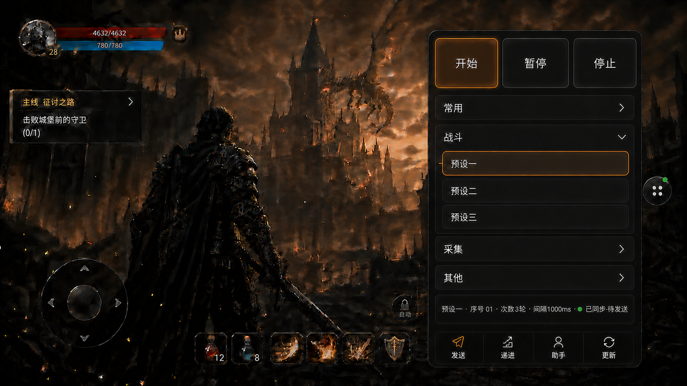

# WPE 模拟器端

这是雷电模拟器使用的原生 Android 客户端。当前只包含发送、递进、助手三个预设模块，不提供预设编辑、滤镜或抓包功能。

按当前移动端设计目标，电脑端作为唯一预设源、管理端和执行端。客户端没有本地快照时，首次连接会自动同步；已有本地快照后，重新连接只验证电脑端连接并刷新运行状态，不会因为电脑端新增或修改预设而自动替换模拟器端列表。需要更新时，在悬浮面板点击“更新预设”。更新时先使用 `GET /MobileSync/manifest` 检查版本摘要，只有摘要变化才拉取 `GET /MobileSync/snapshot`；目标快照包含预设名称、电脑端序号、分组、排序、代码/封包内容、发送次数、发送间隔以及对应模块参数，移动端只读缓存和展示，不提供编辑写回。当前选中模块通过“开始”“暂停”“停止”调用电脑端对应的运行控制接口，暂停后再次开始恢复同一个任务。

选中发送预设后，模拟器端至少显示预设名称、分组、序号、发送次数和发送间隔；这些值来自电脑端同步快照，不能在模拟器端修改。同步失败时继续保留上一份完整快照，不能显示半套数据。

同步快照使用版本号、完整内容哈希和大小校验；分组通过固定 ID 关联，改名或调整顺序不会错绑预设。开始、暂停和停止时携带当前快照版本，电脑端版本已变化时会拒绝执行并提示先更新。断网时可以查看旧快照，但开始、暂停和停止不会伪造成功状态。

设计目标是将完整快照以规范化 UTF-8 JSON（可 gzip）保存在 Android 应用私有的 `SnapshotStore` 版本文件中；`SharedPreferences` 只保存版本指针、选中预设和同步状态，避免大体积封包数据写入轻量配置文件。同步中断时继续使用上一份完整快照。

开发实施规格见 [IMPLEMENTATION_PLAN.md](IMPLEMENTATION_PLAN.md)。

## 构建

用 Android Studio 打开本目录，或使用项目内固定版本的 Gradle Wrapper 执行：

```text
gradlew.bat lintDebug assembleDebug
```

生成文件：`app/build/outputs/apk/debug/app-debug.apk`。

## 连接

移动端使用独立的低权限代理账号和密码认证。首次使用或认证失败时填写 HTTPS 地址、移动端账号和密码；密码使用 Android Keystore 加密保存，只通过 Basic Auth 发送到电脑端。凭据完整时配置页自动隐藏，启动后退回游戏并显示悬浮控制；Activity、粘性前台服务或模拟器开机重建时都会自动恢复连接。首次没有地址时仍使用 `https://192.168.0.100:89/` 作为默认值。

## 悬浮按钮

在雷电模拟器中首次使用时，应用会直接打开 Android 的“显示在其他应用上层”系统授权页。授权后会自动启动一个前台服务：未使用时显示右侧小悬浮按钮，按住拖动可移动到屏幕任意位置并记住新位置，点击后展开无标题栏的快捷面板；再次点击悬浮按钮或面板外部区域可恢复为小按钮。快捷面板顶部依次提供较大的“开始”“暂停”“停止”执行控制，中部直接显示分组和预设，底部以更小的“发送”“递进”“助手”“更新”入口切换功能模块；面板不显示“发送分组”或说明性标题，电脑端 WinForms 页面不改变。

“开始”用于启动当前选中的预设，暂停后可再次开始恢复；“暂停”只在任务运行期间可用，“停止”结束当前任务。任务处于启动、运行、暂停或停止过渡态时锁定预设选择，避免操作按钮与实际运行预设产生歧义。选中预设的名称、序号、发送次数、发送间隔和状态压缩成一行只读摘要。面板不提供新建、编辑、删除或写回预设的入口。

收起态悬浮球只保留两种运行提示和一个普通状态：发送中为绿色暂停图标“Ⅱ”，暂停中为橙黄色继续图标“▶”，未运行或停止后恢复普通深色六点图标。悬浮球可以拖动到任意位置，点击只负责展开/收起面板，不会暂停、恢复或停止电脑端任务；面板收起期间任务继续运行，重新展开后按电脑端 runtime 显示实际状态。悬浮控制的开启/关闭仍由连接/控制页的“开启悬浮按钮”/“关闭悬浮按钮”负责，快捷面板本身不提供关闭入口。

最终界面参考图：[simulator-overlay-final-v1.5.png](docs/references/simulator-overlay-final-v1.5.png)



电脑端远程管理使用 HTTPS；Windows HTTP.SYS 由电脑端完成证书绑定，Android 客户端内置本机连接证书信任，不要求你在模拟器设置中再安装证书。`/MobileSync/*` 仅在局域网内开放，并要求独立低权限代理账号；manifest、完整 snapshot、runtime 以及发送/递进/助手的开始、暂停和停止接口都受 Basic Auth 保护，桌面远程管理后台继续要求管理员账号。雷电模拟器必须能够访问该电脑地址。

完整详情 DTO、稳定分组 ID、版本绑定动作和原子快照缓存已按 [IMPLEMENTATION_PLAN.md](IMPLEMENTATION_PLAN.md) 落地；当前仍需在真实 HTTPS 证书和目标业务环境中完成最终联调验收。
